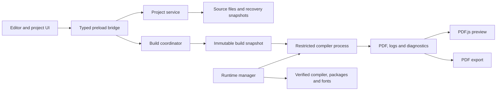

# Resume Maker — Detailed Project Plan

Date: 24 September 2026
Status: Implementation started; see [implementation status](docs/IMPLEMENTATION_STATUS.md). The release scope below remains the target.
Working name: Resume Maker

**25 September workflow amendment:** [Chat-first implementation](docs/CHAT_FIRST_IMPLEMENTATION.md)
records the user's newer direction: Chat is the main screen, Code is secondary, visual PDF
notes can be sent to the agent, and AI connections/models are configured and selected only
in Settings. This supersedes the editor-first and deferred-AI wording below. The original
release, distribution, data-integrity, and compatibility requirements remain
open wherever the implementation status does not provide completion evidence.

**25 September platform amendment:** The user has narrowed this implementation to **macOS on Apple silicon only**. Windows, Linux, Intel Mac and cross-platform runtime equivalence are outside this goal. All other planned product, data-integrity, distribution, accessibility and release requirements continue to apply to the Apple silicon Mac version. Historical comparisons or multi-platform wording later in this plan do not expand that scope.

**26 September documentation and community-delivery amendment:** After implementation, deliver complete user and developer documentation, a demo and tutorial for every feature, a reusable skill based on the documentation, a new public GitHub repository with releases, a complete README and license materials, and a measured performance investigation with a prioritized optimization plan. The user prohibits commercial use. Describe the project accurately as noncommercial/source-available; do not label a commercial-use restriction as OSI open source. Third-party components retain their own licenses. The original Apple silicon implementation scope remains active. [Delivery checklist](docs/DELIVERY_SCOPE.md) tracks the added artifacts and verification requirements.

## 1. Product objective

Build a desktop application that lets someone install one application, choose or import a LaTeX resume, edit its source,
see the resulting PDF beside the editor, and export a finished resume without manually installing a programming runtime
or LaTeX distribution.

The primary product promise is:

> Install, open a template, edit, preview, and export—even without an internet connection.

The default installer must include the application runtime, compiler, a versioned set of LaTeX resources, fonts used by
the supplied templates, and the PDF viewer. Downloading additional resources is an optional expansion path, not a
prerequisite for the first resume.

This plan assumes a local desktop product, no required account, and no cloud compilation service. The current workspace
is empty, so the work starts from a new project.

## 2. Scope and supported systems

### Release target

| Platform | Release target | Distribution |
| --- | --- | --- |
| macOS | Apple silicon; macOS 14 or later is the proposed minimum, pending OS-version acceptance | Signed and notarized `.dmg`, with a tested update archive |

This is the only requested platform. Native development testing on the current Mac does not prove compatibility with every supported macOS version. Release validation must cover the selected minimum and current supported versions on Apple silicon, including clean machines without a LaTeX installation.

Windows, Linux, Intel Mac, mobile and browser-only products are outside this goal. The installer includes the application dependencies but still relies on macOS graphics, fonts infrastructure and system libraries.

### What dependency management means

- End users do not install Node.js, npm, Python, Rust, Docker, TeX Live, MiKTeX, or Homebrew to run the product.
- Application dependencies live in the app bundle or an application-owned data directory.
- The application does not modify the user's global PATH or replace an existing LaTeX installation.
- A normal user installation should not need administrator privileges; validate installation in the user’s Applications folder.
- All included templates must compile from a fresh installation with network access disabled.
- Imported documents may require additional packages, fonts, or a different engine. The app identifies these limitations
  and offers supported recovery options.

Guaranteeing every arbitrary LaTeX document is a separate scope from guaranteeing the application's dependencies. The
release documentation must describe this distinction plainly.

## 3. Users and essential journeys

| User                               | Need                        | Successful journey                                                |
|------------------------------------|-----------------------------|-------------------------------------------------------------------|
| First-time resume author           | A usable starting point     | Choose a template, replace sample text, preview, export           |
| LaTeX user                         | Direct control over source  | Open an existing folder, edit multiple files, inspect diagnostics |
| Job applicant maintaining variants | Several tailored resumes    | Duplicate a project, edit it, export with a distinct filename     |
| Offline or restricted-network user | Predictable local operation | Install from a downloaded installer and finish without internet   |

The home screen offers **New from template**, **Open project**, and **Recent projects**. No account or setup wizard
blocks these actions.

The editor uses a resizable three-part layout: project files at the left, LaTeX source in the center, and PDF preview at
the right. A collapsible diagnostics panel appears below. The toolbar contains save, compile, automatic preview, export,
and settings.

The status area shows unsaved changes, compilation activity, the last successful preview time, and whether the displayed
PDF matches the current document revision.

## 4. Version 1 feature specification

### Project management

- Create projects from at least five bundled templates: minimal, classic, compact technical, academic, and two-column.
- Open a `.tex` file or an existing project folder; import ZIP projects with safe extraction and size limits.
- Select the main `.tex` entry file when several candidates exist.
- Create, rename, and delete project files with recoverable handling for destructive operations.
- Support relative references to local `.tex`, `.sty`, `.cls`, images, and font files.
- Duplicate projects, maintain a recent-project list, and export source as a ZIP archive.
- Detect external file changes and present a conflict choice instead of overwriting either version.

### LaTeX editing

- Syntax highlighting, indentation, line numbers, bracket matching, undo/redo, and search/replace.
- Tabs for multiple files and keyboard shortcuts following each operating system's conventions.
- Curated command completions and snippets for resume sections, lists, links, and common formatting.
- Source-linked errors and warnings where compiler output supplies reliable locations.
- Explicit save plus automatic local recovery snapshots. Recovery must not silently overwrite external changes.
- An optional autosave setting; preview compilation itself does not require saving the user's files.
- Accessible labels, keyboard navigation, adjustable font size, and light/dark themes.

Full semantic LaTeX completion is not assumed to come free with the editor component. A language server can be added
later after measuring its runtime and packaging cost.

### Compilation and preview

- Manual compile and automatic compile after approximately 700 ms of inactivity.
- Local compilation using the packaged engine and a pinned resource bundle.
- One active build per project, bounded global concurrency, cancellation, and timeouts.
- A selectable text layer, zoom, fit-to-width, page navigation, page count, and clickable links in the PDF viewer.
- Keep the last successful PDF visible when a subsequent build fails, clearly marked as out of date.
- Preserve preview zoom and reading position when the PDF refreshes.
- Distinguish syntax errors, missing files, missing packages, font problems, incompatible engine features, and internal
  failures.

### Resume-specific assistance

- Template cards with previews, intended use, supported paper sizes, and font information.
- Insertable sections for experience, education, projects, skills, and contact details.
- A4 and US Letter options for bundled templates, implemented through documented template settings.
- A page-count indicator and overfull-box warnings where reliably detected.
- Text extraction checks for supplied templates to catch missing characters and problematic reading order.
- At least one simple single-column template intended for straightforward machine-readable output. Do not claim
  universal applicant-tracking-system compatibility or an ATS score.

### Export

- Export the exact PDF bytes shown by a successful build of the current revision.
- If the preview is stale, rebuild before normal export; allow exporting the older result only through an explicitly
  labeled action.
- Export a source ZIP containing source, user assets, and the project manifest, excluding caches and temporary files.
- Use atomic writes so a failed export does not damage an existing output file.

### Deferred features

Version 1.1 or later can add a structured form editor, source-to-preview navigation, a managed TeX Live compatibility
pack, template switching for structured resumes, cover letters, and deeper LaTeX intelligence. Cloud sync,
collaboration, AI writing, and mobile apps require separate scope decisions.

## 5. Recommended technical stack

| Layer             | Proposed choice                                                   | Reason                                                                    |
|-------------------|-------------------------------------------------------------------|---------------------------------------------------------------------------|
| Desktop shell     | Electron                                                          | Packages Chromium and Node.js with a consistent desktop UI runtime        |
| UI                | React and TypeScript                                              | Typed UI, reusable components, broad development familiarity              |
| Frontend build    | Vite                                                              | Straightforward development and production asset pipeline                 |
| Source editor     | CodeMirror 6                                                      | Extensible editor with a deliberately limited LaTeX feature set initially |
| PDF viewer        | Mozilla PDF.js                                                    | Local PDF rendering with custom preview controls                          |
| Default compiler  | Tectonic, packaged per platform                                   | Candidate for a compact managed LaTeX runtime                             |
| Packaging         | electron-builder                                                  | Platform installers, resource packaging, signing integration              |
| Local persistence | Ordinary project folders and versioned JSON                       | Portable files; no database server required                               |
| Validation        | Unit tests, compiler integration fixtures, desktop workflow tests | Cover data integrity, compilation, and installation                       |
| CI                | Native Apple silicon macOS runners                          | Native builds plus additional clean-machine release checks                |

Electron embeds Chromium and Node.js and targets Windows, macOS, and Linux. This makes it a good fit for a
self-contained desktop runtime, with a larger download as the tradeoff. This recommendation is an architectural judgment
based on the project's installation requirement. [Electron introduction](https://www.electronjs.org/docs/latest/)

Tauri remains a reasonable alternative if installer size becomes the dominant priority. Its platform webviews differ,
including WebView2 on Windows and WebKit on macOS/Linux; those runtime differences add validation work for this
particular requirement. Developer prerequisites should not be confused with dependencies end users must
install. [Tauri webview reference](https://tauri.app/reference/webview-versions/)

Tectonic is based on XeTeX and normally retrieves supporting files as needed. It is therefore a candidate compiler, not
by itself an offline dependency solution. We must supply and test the local resource bundle. It must also pass the
representative-template compatibility gate before becoming the final engine
choice. [Tectonic overview](https://tectonic-typesetting.github.io/en-US/)

PDF.js and electron-builder provide the proposed viewer and distribution foundations. Exact versions will be pinned
after the initial spike. [PDF.js](https://mozilla.github.io/pdf.js/), [electron-builder](https://www.electron.build/)

## 6. Application architecture



| Component                 | Responsibility                                                                        |
|---------------------------|---------------------------------------------------------------------------------------|
| Renderer                  | Editor, project tree, diagnostics presentation, template browser, preview controls    |
| Preload bridge            | Small typed API between UI and privileged services                                    |
| Project service           | Authorized paths, project import, saves, file watching, recovery, source export       |
| Runtime manager           | Version selection, resource discovery, validation, repair, optional pack installation |
| Build coordinator         | Scheduling, snapshots, cancellation, revision tracking, bounded caches                |
| Compiler adapter          | Engine-specific arguments, environment, output collection, diagnostic parsing         |
| Native restriction helper | Apply and verify OS-specific compiler file, process, and network restrictions         |
| Preview service           | Deliver only approved PDF results to the viewer                                       |
| Update service            | Signed release discovery, staged installation, recovery after failure                 |

The UI cannot directly execute commands or access arbitrary paths. Main-process services validate messages and keep the
operating-system capabilities. Compiler execution occurs outside the UI and main event loop.

The engine adapter exposes operations such as runtime inspection, compile, cancel, and diagnostic normalization. Product
UI code must not depend on a particular engine's CLI flags.

No always-running web server or backend service is required. Local communication uses application IPC and a restricted
application protocol for resources.

## 7. Self-contained dependency strategy

### Default offline installer

Each release artifact contains:

1. Electron and the compiled application.
2. A compiler binary for that OS and architecture, including required redistributable native libraries.
3. A versioned LaTeX resource bundle sufficient for every supplied template and the documented compatibility corpus.
4. Licensed redistributable fonts referenced directly from application/project resources.
5. Templates, preview assets, viewer workers, and offline help.
6. A runtime manifest with engine version, bundle identifier, platform, architecture, checksums, and license inventory.

A prewarmed developer cache is not enough evidence of completeness. Build the resource set reproducibly from pinned
inputs and test it with an empty user cache and no network. If a curated Tectonic bundle proves brittle, choose a larger
verified bundle or a managed TeX Live subset during Phase 0.

### First launch

1. Detect OS and architecture and select the included runtime.
2. Confirm required runtime files and their integrity.
3. Create application-owned writable cache and recovery directories.
4. Register fonts privately for compilation; do not require system-wide font installation.
5. Run a small offline compile self-test.
6. Open the home screen when ready; show actionable repair information if a check fails.

The app launches binaries by absolute path, keeps executable resources outside compressed app archives where necessary,
and avoids depending on the user's shell environment. Test relocation of the installed app and usernames containing
spaces or non-ASCII characters.

### Additional packages and fonts

- The initial release has a documented package set rather than unrestricted package fetching.
- Missing dependencies are reported in plain language, with supported package-pack or local-font actions where
  available.
- Additional packs come from a maintained catalog with signed metadata and pinned content hashes.
- The runtime manager downloads and verifies packs; the compiler does not make arbitrary network requests.
- A local pack import supports offline transfer from another computer.
- Unknown packages or external tools remain an explained compatibility limitation until supported.
- Recovery can reconstruct the original core runtime from the installer; online pack repair resumes safely after
  interruption.

### Compatibility expansion

A later managed TeX Live pack can support pdfLaTeX, XeLaTeX, or LuaLaTeX workflows that are outside the default engine's
scope. Ship all required helper tools for the supported workflows, including any bibliography or scripting runtimes,
inside that pack. Do not tell users to install a global toolchain as the normal recovery path.

TeX Live offers configurable and portable installation approaches, but a full installation requires several gigabytes. A
compatibility pack needs its own size budget and release
validation. [TeX Live guide](https://tug.org/texlive/doc/texlive-en/texlive-en.html)

Projects record the selected engine and resource-bundle version. Updates do not silently change an existing project's
compiler. If an old runtime must be retired for security, offer a tested migration with a backup and visible output
differences.

## 8. Reliable compilation and live preview

### Build sequence

1. Observe editor changes and assign a monotonically increasing project revision.
2. After the debounce interval, collect all relevant source files and unsaved buffers.
3. Create an immutable temporary snapshot preserving project-relative paths. Copy ordinary files; do not use writable
   hard links to originals.
4. Associate the snapshot with the revision, chosen runtime, bundle, and settings.
5. Run the compiler using the snapshot and an isolated output directory.
6. Enforce a default 30-second timeout and bounded output/log sizes, with configurable limits for larger projects.
7. Normalize diagnostics, validate the produced PDF, and store the result under the build identifier.
8. Publish the result only if it is still applicable to the current project revision.
9. Replace the preview without resetting zoom or position and release older PDF rendering resources.
10. Retain only a bounded set of successful results and recovery artifacts.

If more edits arrive during compilation, keep only the newest pending revision. Cancel the active build when
appropriate, terminate its entire process tree, and discard late results. Superseded output must never overwrite a newer
preview.

Build states are `idle`, `queued`, `building`, `success`, `error`, and `cancelled`. Dependency preparation is a separate
state so a download is not confused with slow compilation.

### Compiler behavior and limitations

The documented Tectonic CLI includes a local bundle option, cached-only operation, output-directory selection, log
retention, SyncTeX output, and untrusted-input mode. The adapter must verify behavior against the pinned version and
selected local bundle
format. [Tectonic compile reference](https://tectonic-typesetting.github.io/book/latest/v2cli/compile.html)

Use untrusted-input mode for imported documents and disable shell escape throughout the supported default workflow.
These flags reduce risky engine features; they are not a complete operating-system filesystem sandbox.

Treat line references as best-effort diagnostics. When a reliable location cannot be established, show the relevant log
excerpt without inventing a source position.

Source-to-preview navigation is deferred until basic preview reliability is complete. It will require consuming SyncTeX
mappings, translating temporary snapshot paths back to project paths, and mapping PDF coordinates correctly.

## 9. Project data and future form editing

Projects remain readable outside this app:

```text
my-resume/
  main.tex
  sections/
    experience.tex
    education.tex
  assets/
  fonts/
  resume.project.json
```

The optional versioned manifest stores a project ID, display name, main-file path, engine and bundle identifiers,
template origin/version, compilation options, and schema version. Paths are relative to the project root. An ordinary
folder without a manifest can still be opened.

App preferences and recent-file metadata belong in platform-standard application data directories. Build caches and
recovery snapshots live outside the user's source tree. Resume content is stored locally; operating-system permissions
protect it, but this plan does not claim application-level encryption.

Recovery writes use a transactional journal or atomic file replacement. Reopening after a crash offers recovery and
keeps the original files available. Changing a manifest schema requires migration tests and a backup.

A later structured editor will use a separate `resume.json` schema covering contact details, summary, experience,
education, projects, skills, and publications. The schema generates source through controlled templates. Form values are
escaped correctly before insertion into LaTeX.

Do not promise lossless two-way conversion between arbitrary LaTeX and forms. Structured projects can expose
generated-source previews and explicit conversion to source editing; freely edited source remains the authority in
imported LaTeX projects.

## 10. Security, privacy, and reliability requirements

These requirements apply directly to opening files, running LaTeX, rendering PDFs, and distributing executables.

### Application boundary

Use renderer sandboxing, context isolation, disabled renderer Node integration, a restrictive content security policy,
validated IPC, and restricted navigation. Load application assets locally and allow external links only through
validated HTTP/HTTPS actions. These choices follow Electron's documented security
guidance. [Electron security](https://www.electronjs.org/docs/latest/tutorial/security)

### Compiler boundary

- Spawn fixed executable paths with argument arrays; never interpolate document text into shell commands.
- Canonicalize project paths, reject traversal, and prevent symlinks from escaping the authorized project snapshot.
- Constrain compiler reads to the snapshot and runtime resources, writes to build outputs, and deny network access using
  a verified platform mechanism.
- Test macOS sandbox options on Apple silicon during Phase 0. Package any required helper; do not assume a subprocess alone provides isolation.
- Scrub unnecessary inherited environment variables and apply resource limits supported by macOS.
- Test hostile inputs attempting filesystem reads, outside writes, shell execution, network access, and runaway
  processing.
- Do not enable imported-project compilation on a platform until its isolation acceptance tests pass. Treat failure here
  as a release blocker or an explicit scope reduction, not an invisible downgrade.

### PDF and archive handling

Disable document scripting and unsolicited remote fetches in the PDF viewer. Treat links as untrusted input. Bound
extracted archive size, file count, nesting, and individual file size; reject traversal and unsafe links before
importing a ZIP.

### Updates and downloads

Use HTTPS plus authenticated release/pack metadata, checksums, atomic installation, and failure recovery. A checksum
downloaded beside a file is not sufficient authentication by itself. Separate immutable application resources from
writable caches so compilation does not alter a signed installation.

### Privacy and licensing work

Resume content stays on the user's computer by default. There is no required telemetry or cloud upload. A support-bundle
action previews what will be included and removes resume text, usernames, absolute paths, and environment details
wherever possible.

Maintain a dependency and font inventory, third-party notices, and an SBOM. Review redistribution requirements for every
shipped runtime, package, font, and template before release; retain required notices and source-related materials.
Prefer original templates and clearly redistributable fonts to simplify distribution.

## 11. Quality targets and release acceptance

The numbers below are engineering targets, not measured performance claims. Phase 0 establishes representative hardware
and a fixed one-to-two-page resume corpus, then records cold and warm results separately.

| Area               | Proposed acceptance target                                                                                                               |
|--------------------|------------------------------------------------------------------------------------------------------------------------------------------|
| Installation       | Fresh supported machine installs and launches with no developer toolchain or preinstalled LaTeX                                          |
| Offline operation  | Every bundled template creates, compiles, previews, and exports with network disabled and empty user caches                              |
| Compatibility      | 100% of the published supported-template corpus passes; unsupported cases are documented                                                 |
| Startup            | Installed app opens an editable project within 5 seconds on the reference machine, excluding first-run verification                      |
| Warm preview       | 95th percentile under 3 seconds after debounce for the reference corpus                                                                  |
| Cold compilation   | Target under 15 seconds for the reference corpus; measure first-run resource preparation separately                                      |
| Responsiveness     | Typing and navigation remain responsive while compiling and rendering                                                                    |
| Cancellation       | Compiler process tree stops within 2 seconds on tested platforms                                                                         |
| Recovery           | Forced termination loses no more than the configured recovery interval, initially targeted at 2 seconds                                  |
| Export correctness | Exported bytes match the selected successful current-revision PDF                                                                        |
| Text fidelity      | Names, contact details, and section content extract correctly from bundled template PDFs                                                 |
| Resource use       | Establish memory/CPU budgets from prototype measurements; no unbounded queue, cache, or viewer growth                                    |
| Installer size     | Initial investigation target: core installer under 750 MB compressed and under 2 GB installed; revise using measured bundle completeness |

Functional completeness takes priority over an arbitrary installer-size target. Record exact sizes per platform before
release rather than advertising estimates.

### Test layers

| Layer                | Important checks                                                                                                          |
|----------------------|---------------------------------------------------------------------------------------------------------------------------|
| Unit                 | Revision scheduling, stale-result rejection, path validation, manifest migration, diagnostics, safe extraction            |
| Compiler integration | Real template builds, missing fonts/packages, Unicode, nested files, timeouts, cancellation                               |
| PDF regression       | Page counts, extracted text, links, and rendered-image comparisons with controlled tolerances                             |
| Desktop workflows    | New/open/edit/save/preview/export/reopen, keyboard navigation, file conflicts, crash recovery                             |
| Installer and update | Fresh offline install, relocation, repair, interrupted update, upgrade with old projects, uninstall preserving user files |
| Isolation            | Outside-file reads/writes, network denial, shell escape, malicious paths and archives                                     |
| Platform checks      | Native architecture, standard user permissions, high-DPI screens, OS-specific shortcuts and dialogs                       |

Cross-platform PDF bytes need not be identical. Compare layout and text under pinned fonts/resources; use byte equality
specifically when proving that export copies the displayed build.

CI runners can hide missing dependencies because build tools are already installed. Release validation must also use
clean VMs or fresh test accounts/machines without a LaTeX toolchain, and physical devices where virtualization cannot
prove behavior.

## 12. Delivery phases and estimates

Planning assumption: two experienced engineers, part-time design/QA support, access to Apple silicon macOS test
environments, and signing credentials available by the packaging phase. Allocate approximately 14 weeks including
stabilization. Re-estimate after Phase 0; an experienced solo developer should plan roughly 24–32 weeks for the same
release scope.

| Phase                                | Window      | Main work                                                                                                                                                 | Deliverable and exit condition                                                                                                            |
|--------------------------------------|-------------|-----------------------------------------------------------------------------------------------------------------------------------------------------------|-------------------------------------------------------------------------------------------------------------------------------------------|
| 0. Feasibility                       | Weeks 1–2   | Confirm OS matrix; compare compiler candidates; build representative template corpus; prototype local bundles, font resolution, isolation, and installers | Decision record, measured sizes/timings, offline compile on each target; unresolved packaging or isolation issues must have a viable path |
| 1. Desktop foundation                | Weeks 3–4   | App shell, typed bridge, project service, templates, editor, save/recovery, build CI                                                                      | Installable internal app can create, edit, save, recover, and reopen a project                                                            |
| 2. Compilation and preview           | Weeks 5–6   | Compiler adapter, snapshots, scheduling, diagnostics, PDF viewer, export                                                                                  | Reliable edit-to-preview loop; errors preserve previous preview; exported PDF matches current build                                       |
| 3. Dependency and project robustness | Weeks 7–8   | Final offline bundle, runtime verification/repair, ZIP import/export, file conflicts, isolation implementation                                            | Clean offline workflow passes; interrupted preparation recovers; imported-project boundary tests pass                                     |
| 4. Product beta                      | Weeks 9–10  | Five polished templates, resume snippets, paper settings, accessibility, performance, help                                                                | Beta users complete resumes; supported corpus and usability checks pass                                                                   |
| 5. Distribution                      | Weeks 11–12 | Native installers, signing/notarization, update flow, upgrade tests, notices/SBOM                                                                         | Release candidate artifacts pass installation, update, and uninstall checks on every supported target                                     |
| 6. Stabilization                     | Weeks 13–14 | Fix beta defects, repeat affected checks, security/dependency review, support documentation                                                               | No release-blocking defects; installers and known limitations ready for publication                                                       |

Packaging prototypes start in Phase 0 even though production release work is later. Signing-account setup and
certificate procurement start in week 1 to avoid becoming the final blocker.

### Work allocation

- Engineer A owns desktop UI, editor, viewer, templates, and accessibility.
- Engineer B owns compiler integration, runtime packaging, storage/recovery, platform restrictions, and release
  automation.
- Both review IPC contracts, imported-file handling, migration behavior, and current-revision export semantics.
- QA/design support develops the workflow checklist and tests beta builds on fresh systems.

The critical path is compiler and bundle feasibility → secure process execution → reliable preview → offline
installers → native release validation. Structured forms, AI features, and extra platforms must not displace this path.

## 13. Initial implementation backlog

| ID     | Priority | Work item                                    | Depends on             | Acceptance evidence                                 |
|--------|----------|----------------------------------------------|------------------------|-----------------------------------------------------|
| RM-001 | P0       | Record platform and engine decisions         | None                   | Approved support matrix and compatibility corpus    |
| RM-002 | P0       | Produce offline compiler prototype           | RM-001                 | Fresh-cache offline PDFs on target architectures    |
| RM-003 | P0       | Prove platform process restrictions          | RM-001                 | Host-file, shell, and network isolation tests       |
| RM-004 | P0       | Scaffold desktop app and typed IPC           | RM-001                 | Packaged window and validated service calls         |
| RM-005 | P0       | Implement project files, saves, and recovery | RM-004                 | Reopen, crash recovery, and conflict tests          |
| RM-006 | P0       | Add editor and basic LaTeX support           | RM-004, RM-005         | Multi-file edits, snippets, search, undo            |
| RM-007 | P0       | Implement revisioned build coordinator       | RM-002, RM-003, RM-005 | Cancellation and late-result rejection tests        |
| RM-008 | P0       | Add PDF preview and matching export          | RM-007                 | Successful current-revision preview/export workflow |
| RM-009 | P0       | Add compiler diagnostics                     | RM-007                 | Known fixture errors mapped accurately              |
| RM-010 | P0       | Finalize bundled templates and fonts         | RM-002, RM-006         | All template variants pass offline corpus tests     |
| RM-011 | P0       | Runtime verification and repair              | RM-002, RM-004         | Corruption and interrupted-preparation recovery     |
| RM-012 | P1       | Safe ZIP import and source export            | RM-003, RM-005         | Round-trip projects and hostile archive rejection   |
| RM-013 | P1       | Accessibility and usability pass             | RM-006, RM-008         | Keyboard and screen-reader workflow checks          |
| RM-014 | P0       | Signed installers and update delivery        | RM-010, RM-011         | Native clean-machine install/upgrade evidence       |
| RM-015 | P0       | Release validation and documentation         | All version 1 items    | Completed release checklist and known limitations   |

P0 means essential to the core promise or release safety. P1 improves the planned version 1 experience and can move to a
later release only through an explicit scope decision.

## 14. Proposed repository structure

```text
resume-maker/
  apps/
    desktop/
      src/main/
      src/preload/
      src/renderer/
  packages/
    contracts/
    project-core/
    compiler/
    runtime-manager/
    latex-support/
  native/
    process-restrictions/
  resources/
    templates/
    fonts/
    runtime-manifests/
  scripts/
    prepare-runtimes/
    package/
    release/
  tests/
    fixtures/
    integration/
    desktop/
    installers/
  docs/
    architecture/
    user-guide/
    release-checklist/
  PROJECT_PLAN.md
```

Large compiler bundles are versioned build artifacts, not casually committed binary blobs. CI retrieves authenticated
pinned inputs and records provenance. Developer setup may require Node.js and native build tools; the final installer
must not transfer those requirements to end users.

## 15. Distribution, updates, and maintenance

Build releases in native Apple silicon CI, package the matching compiler/native libraries, and
inspect the resulting dependency closure. Sign macOS app components; notarize the macOS
distribution and test a downloaded build. Signing identifies the publisher but is not a promise that every reputation
warning disappears. [Electron distribution guide](https://www.electronjs.org/docs/latest/tutorial/distribution-overview)

Use electron-builder and its matching updater path for the Apple silicon macOS artifacts. Validate the actual
package/update combination early and provide a download-and-reinstall fallback. [electron-builder](https://www.electron.build/), [Electron autoUpdater](https://github.com/electron/electron/blob/main/docs/api/auto-updater.md)

Use stable and beta channels, signed release metadata, and a small initial rollout before general availability.
Save/recover active editing work before an update restarts the app. Runtime-pack installation can roll back by switching
to the last verified pack; app downgrade is offered only if the data schema supports it.

Release artifacts include installers, checksums, release notes, supported-platform and template lists, third-party
notices, and troubleshooting instructions. Uninstallation preserves user-created projects; deleting caches and
preferences is a separate, explicit choice.

After release, assign ownership for dependency/security updates, compiler-bundle regressions, bug triage, and OS
upgrades. Run the compatibility corpus before changing any engine, package set, or supplied font.

## 16. Risks and decision rules

| Risk                                          | Consequence                                   | Response                                                                                |
|-----------------------------------------------|-----------------------------------------------|-----------------------------------------------------------------------------------------|
| Default engine fails popular templates        | Imported resumes do not compile               | Gate engine choice on a real corpus; select a managed TeX Live subset if necessary      |
| Resource bundle is incomplete                 | Offline first use fails                       | Empty-cache/network-disabled tests for every supported template variant                 |
| Installer grows too large                     | Slower downloads and higher hosting cost      | Measure early; separate optional compatibility packs without weakening the offline core |
| Platform isolation is hard to package         | Untrusted documents can exceed allowed access | Prototype in Phase 0; block affected import support until restrictions pass             |
| Font discovery differs by OS                  | Changed line wrapping and pagination          | Bundle fonts and reference them deterministically; compare rendered results             |
| Builds finish out of order                    | Preview or exported resume is stale           | Revision identifiers, immutable results, cancellation, current-revision export checks   |
| Existing files change outside the app         | User content is overwritten                   | Conflict detection, atomic writes, recoverable versions                                 |
| Upgrade changes resume appearance             | Users lose reproducibility                    | Pin engine/bundle per project; explicit migration and regression comparison             |
| Native-library dependency is missed           | Works on developer machine only               | Inspect packaged binaries and test on clean supported systems                           |
| Certificate or release infrastructure is late | Distribution slips                            | Start signing setup in week 1 and ship internal installer prototypes early              |

## 17. Resources and cost planning

The major investment is approximately 28 engineering person-weeks under the two-engineer schedule, plus part-time
design/QA. Treat this as a planning estimate with risk concentrated in native compiler packaging and process
restrictions.

Budget separately for signing and developer accounts, build minutes, test hardware or VMs, artifact storage/download
bandwidth, and support. No ongoing inference or cloud compilation budget is required for this local-only version. Obtain
current vendor prices when preparing a financial budget rather than fixing unverified prices in this technical plan.

A useful release-size model is: installer size × new installations, plus update payload size × updating installations,
plus optional-pack downloads. Measure these artifacts before estimating hosting costs.

## 18. Definition of done

Version 1 is complete when a user on every advertised supported target can:

1. Install the downloaded app on a clean machine without setting up a toolchain.
2. Create a project from each bundled template while offline.
3. Edit LaTeX and see a current, readable PDF preview.
4. Open the documented supported class of existing LaTeX projects.
5. Understand and fix common errors without losing the previous successful preview.
6. Save, close, reopen, and recover interrupted work reliably.
7. Export a PDF that exactly matches the chosen current build.
8. Update the application without losing projects or silently changing their compiler configuration.

The release also requires verified compiler restrictions, native installer tests, a documented compatibility boundary,
required distribution notices, and actionable help for failed installation or compilation.

The first implementation milestone is a packaged vertical slice: one bundled template, one editor, one local compiler,
one PDF preview, and one export action, working offline on the selected Apple silicon macOS versions. Its measurements decide the final
compiler/bundle choice before the broader feature set is built.
