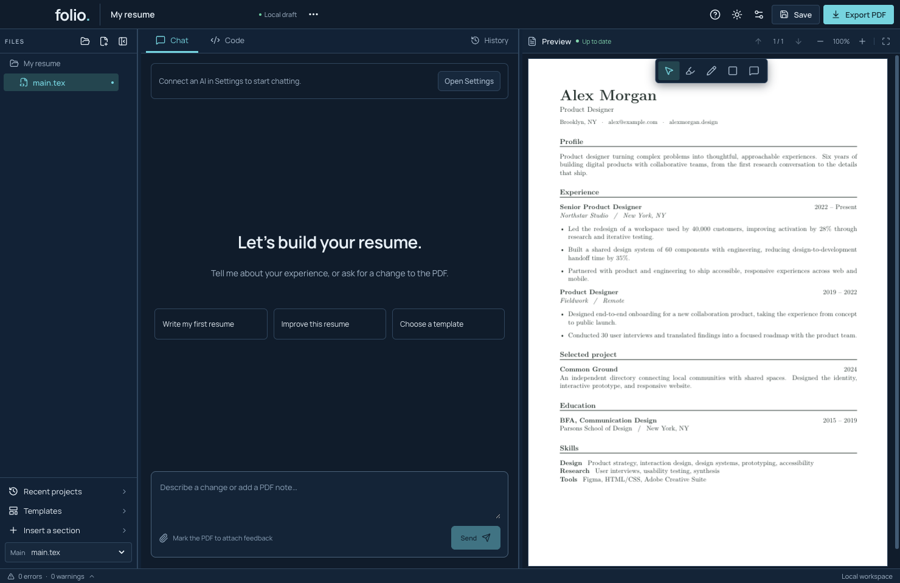

# Folio

**Talk about your resume. See the result.**

Folio is a local LaTeX resume studio for **Apple silicon Macs**. Chat is the main screen, with your PDF alongside it. Mark a part of the PDF, attach your feedback, and ask your AI to change it. The Code tab is there when you want to edit the TeX yourself.

[Website](https://grawish.github.io/folio/) · [Screenshot demos](https://grawish.github.io/folio/demos.html) · [Getting started](docs/tutorials/first-resume.md) · [User guide](docs/APP_GUIDE.md) · [Feature guides](docs/FEATURE_GUIDE_INDEX.md) · [Release status](docs/RELEASE_GAP_AUDIT.md)



## Development preview

The source is available now. Folio is under active development; a signed, notarized installer and automatic updates are not available yet. Local unsigned builds have passed 117 unit/protocol tests and nine packaged native workflow suites on the development Mac. These are local results, not a claim of compatibility with every macOS version.

Windows, Linux and Intel Macs are outside this release's scope. Read the [remaining release requirements](docs/RELEASE_GAP_AUDIT.md) before relying on the preview for important documents.

## What you can do

- Start with six resume templates, each in A4 and US Letter.
- Chat with an agent that edits TeX, builds locally, and reviews PDF images.
- Highlight, draw, or leave notes on the PDF and attach them to a message.
- Compare versions, undo changes, and restore earlier work.
- Edit multiple TeX files with syntax highlighting, search, snippets, and undo.
- Save, use optional autosave, import source ZIPs, and export a clean PDF.
- Review outside-file changes and recover interrupted saves or imports.
- Use dark, light, or system appearance and resize the writing and PDF panes.

**AI lives in Settings.** Add and select an installed Codex or Claude Code connection, use your own OpenAI or Anthropic API key, or configure a compatible endpoint. Account access and model image support depend on your provider. API use is billed separately by that provider. Live Claude/BYOK account acceptance remains on the release checklist.

The compiler works locally without AI. AI requests send relevant source and PDF images to your selected provider; local compilation does not mean that cloud AI requests stay on your Mac. Keys are kept in protected local storage and excluded from project exports.

## Run on your Mac

You need an Apple silicon Mac, Node.js 24, npm, and internet for the initial developer setup. No separate TeX installation is needed.

```sh
git clone https://github.com/grawish/folio.git
cd folio
npm ci
npm run setup
npm run dev
```

Setup downloads checksum-pinned compiler resources and verifies offline compilation. Fresh preparation can take a minute. Later launches reuse the prepared runtime. Do not run the app as root.

```sh
npm run typecheck
npm test
npm run build
npm start
```

The [prepared release pipeline](docs/RELEASE_PIPELINE.md) covers source checks, source previews, website deployment and Mac candidate qualification; publishing its workflow files currently awaits GitHub workflow permission. See [contributing](CONTRIBUTING.md) for native integration tests and packaging, and [architecture](docs/ARCHITECTURE.md) for the code map.

## Learn and contribute

Start with [your first resume](docs/tutorials/first-resume.md). The [feature matrix](docs/FEATURE_GUIDE_INDEX.md) links 22 screenshot walkthroughs and reproducible demos. A [reusable Folio skill](docs/DOCUMENTATION_SKILL.md) packages the guides for your assistant. The [performance investigation](docs/PERFORMANCE_IMPROVEMENT_PLAN.md) includes raw measurements and ranked optimization experiments.

Bug reports should describe what happened, what you expected, and your macOS/app version. Use a small synthetic example and remove personal details from logs and screenshots. See [security reporting](SECURITY.md) for sensitive issues.

## License

Folio's original code, documentation, and examples use [PolyForm Noncommercial 1.0.0](LICENSE). Keep the [required notice](NOTICE). This is a **noncommercial, source-available community project**, rather than OSI open source. The full license defines permitted use.

Your resume remains yours. Third-party libraries, fonts, compiler components, and TeX resources retain their own licenses. See [licensing](docs/LICENSING.md) and [third-party notices](THIRD_PARTY_NOTICES.md). The complete binary redistribution audit remains a release requirement.
