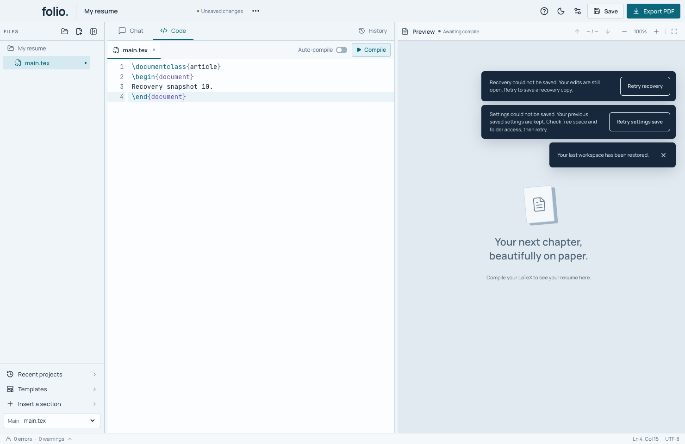

# Keep recovery saves small and retry failed writes

Folio keeps a local recovery copy so it can reopen your draft. This is separate from **Save**, which updates your chosen project folder. The changes described here are included from preview 5, not the older preview-4 download.

## If recovery cannot be saved

Keep Folio open. Your current edits are still available. Check free space and access to the app's data folder, then click **Retry recovery**. The button saves your latest draft, including edits made after the warning appeared. The warning stays until a write succeeds. If Settings also failed to save, its separate **Retry settings save** button remains visible.

Use **Save** to keep a project copy in your chosen folder. A recovery warning does not mean that an otherwise successful project save was rolled back. Wait for the save result, and keep any warning visible until it is resolved. See the [plain-language tutorial](tutorials/save-and-recover.md#if-recovery-cannot-be-saved).



## What changed

| Part | Behavior |
| --- | --- |
| Automatic renderer recovery | One active native write and one newest waiting project. New edits replace the waiting snapshot. |
| Write failure | Retain the newest pending project and pause automatic attempts until an explicit retry or lifecycle flush. |
| Native admission | At most four accepted unfinished recovery calls. Extra calls reject as busy; rejected calls are not queued or acknowledged as saved. |
| Successful acknowledgement | Wait for the temporary file to be written and flushed, renamed into place, and its directory flushed. |
| Normal close, update restart and project operations | Drain renderer recovery before dependent work. Normal project Save remains usable after a failed recovery attempt. |

`src/shared/recovery-writes.ts` owns the active/pending renderer slots. `src/App.tsx` connects the existing 500 ms edit debounce, explicit flushes, project identity changes and retry UI. `electron/core/project.ts` admits and orders recovery writes with other project operations; the redundant native promise chain has been removed. `save-io.ts` supplies the existing flushed replacement helper. Clearing recovery follows already accepted writes.

An accepted native call still means that its own snapshot was written. It is never silently replaced by a later snapshot. Coalescing happens before the renderer sends automatic snapshots across IPC. A failure during directory flush can happen after the new file has been renamed; Folio reports that failure instead of claiming a successful durable save.

## Verification

```sh
node --import tsx --test tests/recovery-writes.test.ts tests/recovery-admission.test.ts
npm test
# On an Apple silicon Mac, with an isolated packaged app:
node scripts/test-recovery-writes.mjs /path/to/Folio.app/Contents/MacOS/Folio
```

Fifteen focused controls cover large bursts, write failure/retry, project identity, reentrant completion, explicit flush ordering, guided-recovery markers, recovery clearing, and file/rename/directory-flush failures. The complete source suite passes 442 tests.

The packaged fixture edits through the actual UI, delays only its own recovery-file rename, and verifies two writes for eight separated edits: the active snapshot and the newest waiting snapshot. The same fixture against the previous app writes all eight snapshots and fails that assertion. It also checks failure retention, independent Settings/recovery notifications, real IPC admission (four accepted and 96 rejected while held), exact recovery bytes and normal close/reopen. No AI account is used. See [the verification record](releases/recovery-writes-verification.json) for exact source, app and script identities and subsequent regression results.

The native fixture is included in the release runner and its result/screenshots are retained by the candidate workflow. Packaged workspace, chat, interrupted-save, preference, import-recovery and import workflows also pass. The chat fixture now waits for Save As to release its input barrier; its earlier timing failure is retained in the verification record. The complete hosted Apple silicon qualification at `5b7b288` passes 442 source tests, 18 compiler integrations, twelve unchanged template images and all twenty native suites. The downloaded artifact and all 165 retained files were independently checked against the source and local package. See [hosted evidence](releases/mac-recovery-writes-hosted.json).

## Limits

This bounds the number of recovery requests kept by these components. It does not measure total Electron memory, IPC transport buffering, all project operations, cache growth or retained recovery copies. Flushing files and directories does not prove physical power-loss behavior. An abrupt quit before a recovery write finishes can still lose recent unsaved edits. The public installer remains unchanged.
