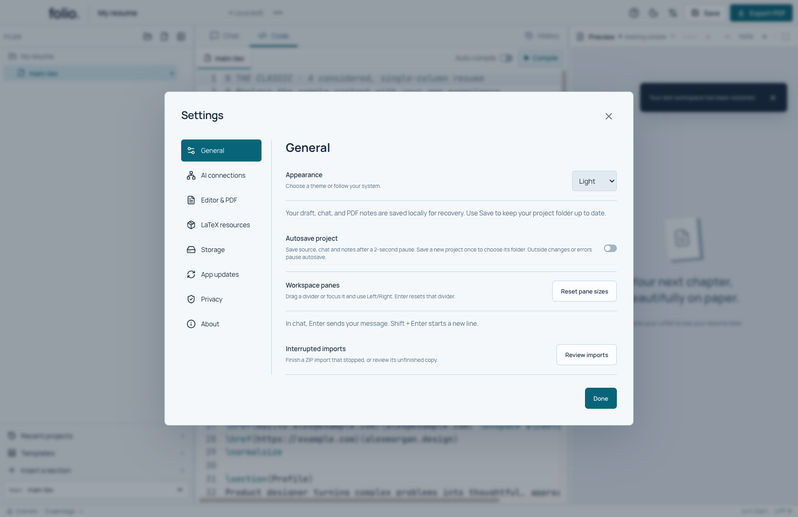
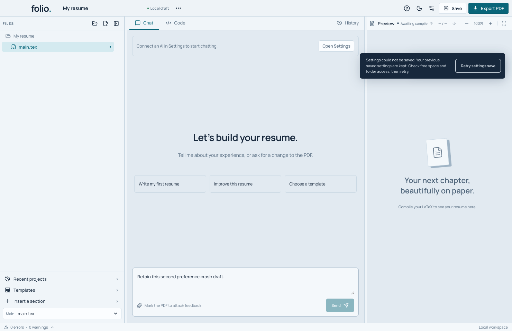

# Workspace panes and autosave

## Resize the workspace

Drag the divider beside Files or between Chat/Code and the PDF. The divider can also receive keyboard focus with Tab:

- Left/Right moves it by 10 pixels; Shift + Left/Right moves it by 40.
- Home/End selects the smallest/largest allowed width.
- Enter or double-click resets that divider.
- **Settings → General → Reset pane sizes** resets both.

Folio remembers the sidebar width and writing/PDF proportion on this device. Hiding the sidebar preserves the preference. A smaller window temporarily constrains the widths so controls remain usable; expanding it restores the preferred proportions. The sidebar keeps at least 176 pixels, writing pane 360, and PDF pane 420. At the supported minimum 1040 × 680 window, both dividers remain usable. Very narrow browser previews may scroll horizontally; they are not the supported desktop size.

Resizing does not remount the editor or change the document. Its undo history remains available. The PDF already uses a resize observer to adjust page rendering and annotation coordinates. Dividers expose separator roles, names, controlled panes and current/min/max sizes. Full screen-reader and native high-DPI acceptance remains a release task.

When a new PDF is loading, the previous document stays alive for resizing and zooming until its pages are replaced. A short loading message identifies this state; annotations wait for the matching new PDF. The old worker is then released. Pending loads that are superseded, and all remaining loads on unmount, are disposed. This also preserves page, zoom and scroll state through a same-length replacement.

The annotation tools are positioned inside the PDF area, below the preview controls and any stale/loading notice, so the notice remains readable in a narrow pane.

## Remember settings after an unexpected quit

The development app saves Automatic preview, Autosave project, Editor text size, Appearance and pane sizes in a small native settings file. It loads that file before opening the workspace, so a saved disabled Automatic preview does not become enabled while source recovery opens. Browser previews still use browser storage. This behavior is newer than the public preview 4.

When first opening an older profile, Folio copies valid existing browser preferences into native storage. After that, the native copy is authoritative. Changing a setting updates the current view immediately; saving happens asynchronously. A change interrupted before it finishes is not guaranteed to survive. Ordinary close and app-update restart wait for pending preference saves.

If a write fails, **Settings could not be saved** stays visible. The previously saved values remain on disk and your newest changes remain queued in the open app. Check disk space and folder access, then click **Retry settings save**. The retry saves the latest values, including settings changed while the error was visible.

An unknown, damaged, oversized or linked settings file is kept rather than silently replaced with defaults. Folio shows **Your settings could not be opened** before it restores the workspace. **Try again** retries the read; the native close button still works. Project and source-recovery files are kept. Do not delete an unfamiliar settings file to bypass the message.

The native file is `workspace-preferences.json` in Folio's app-data directory. Its versioned record accepts only the five known values; types, lengths and pane/text-size ranges are checked in the main process. Updates replace the file atomically and serialize independent control changes. The renderer keeps one active write and at most one newest pending value per preference, so a long divider drag cannot build an unlimited renderer queue. This is application-process crash recovery, not proof of filesystem or power-loss durability.

## Optional autosave

**Settings → General → Autosave project** is off by default. Once enabled, it saves source, project details, chat, notes and history after a two-second pause. The preference is remembered. A new project still needs one explicit Save to choose its folder; autosave never opens a folder picker.

Automatic preview and autosave are separate. You can build unsaved text, or save source that currently has a TeX error. Local recovery of source/chat/notes continues whether autosave is on or off. The two-second timer is an idle delay, not a maximum write or recovery latency guarantee.

Autosave waits while an AI request, project dialog, native project selection, import, disk reload or another save is active. It resumes afterward when there are pending changes. Edits made during a save remain in the editor and trigger a later save; they are not replaced by the earlier snapshot. If that save fails, recovery scheduling restarts for the newest editor text even while autosave remains paused. Closing waits for an in-flight save and flushes the latest local recovery. Switching autosave off does not interrupt a save already committing.

When outside files change, the header shows **Autosave paused** and the existing review flow is available. If the change is reverted, the watcher can clear it and autosave can resume. If a background attempt detects a conflict or fails, the error remains paused until a successful explicit Save, toggling the preference, or reopening the project. **Save to retry** is available for errors without a pending outside-change review. Autosave never chooses the manual save dialog's overwrite action.

## Save boundary

The dedicated `project:autosave` IPC route accepts a validated project, uses its registered directory and cannot select another directory or enable overwrite. Inside the serialized project save queue, it scans the current source/assets/metadata against the registered baseline before preparing a transaction. Any observed outside change stops the background save. The ordinary per-file conflict and journal checks still apply before commit. This includes delayed watcher notifications; the watcher is not the authority for overwrite permission.

Autosave reuses the journaled source/manifest/history/saved-copy transaction. A failed history archive or file write leaves the previous saved project intact. Recovery and ordinary Save As protections remain in place. The usual filesystem/power-loss/platform limits in `SAVE_RELIABILITY.md` apply; this feature adds no cross-platform durability claim.

## Verification

The native preference change has 15 focused controls for migration, independent concurrent updates, invalid/damaged/linked records, failed replacement and retry, three real writer-kill boundaries, and bounded renderer coalescing with 10,000 queued pane edits. All 407 source tests pass.

`scripts/test-preferences.mjs` changes all five preferences through real controls, verifies both pane dividers move, kills the packaged app twice and checks the actual reopened settings and chat drafts. It also exercises a native write failure and retry, plus an unknown-format startup error that preserves the settings and recovery files while allowing normal close. The identical final fixture rejects the older package at the Auto-compile preservation assertion. An additional run with `--legacy-app /path/to/older/Folio` migrates a real older Chromium profile. Full workspace/autosave, interrupted-save, runtime repair, chat/PDF and strict app-crash workflows also pass on the exact final local package.

The [verification record](releases/workspace-preferences-verification.json) retains exact inputs, output hashes, screenshots and the earlier retry-button failure and pane-fixture correction. The Mac qualification runner now has eighteen native suites; full hosted qualification of this changed app remains pending. Process-kill controls do not prove physical power-loss durability or acceptance on every supported Mac.

`tests/autosave-layout.test.ts` checks pane bounds/preferences, source/asset/metadata additions/edits/deletions, unknown projects, overwrite/alternate-directory rejection, queue ordering and history-preparation failure. Current whole-app test counts are recorded in the release audit.

`npm run test:workspace` runs an isolated Electron workflow: first-save behavior, native background IPC conflict rejection, drag and keyboard sizing, toolbar hit-testing, editor undo, settings, source/chat autosave, typing during a held native write, actual write failure/rollback, manual retry, pending native project selection, close during autosave, preference persistence and recovery with autosave disabled. It uses synthetic folders and a scoped native write hook. A packaged executable may be passed to `node scripts/test-workspace.mjs`.

The chat regression additionally holds a synthetic AI request while the user edits source, verifies that autosave waits, then cancels and checks that retained manual changes save afterward. Run native UI suites sequentially: a separate Electron test window can interrupt pointer capture during a drag. Test scripts must read full TeX fixtures from disk, not CodeMirror's virtualized DOM.

Hosted candidate `59d28bd` passed seven native suites, then the workspace test's final reopen showed invalid TeX. A focused local comparison demonstrates the matching failure mechanism: after scrolling, Playwright's contenteditable `fill` replaces only rendered lines and leaves hidden source behind. The test now uses the editor's Select All command followed by text input, verifies full recovered source, and explicitly exercises replacement with the document's beginning outside the rendered viewport. For intentionally held saves, full-text verification happens after releasing the transaction. The complete corrected native workflow passes with no renderer errors. Application code and all 37 compiled outputs remain unchanged; final hosted package qualification is still required. See [the evidence record](releases/workspace-input-verification.json).

The first hosted Mac failure and its local reproduction exposed two test assumptions at a 1040-pixel window. The default writing pane is 426 pixels wide and can grow only to 432 while keeping the PDF usable; expecting more than 486 was incorrect. The drag check now tests movement in both directions against the divider's announced bounds, at initial, 1480-pixel and 1040-pixel window sizes. It also verifies undo against the full recovery buffer because the name near the top of the source may be outside CodeMirror's rendered viewport. The original failure was reproduced locally against the unchanged packaged app. Window/display geometry and pane widths are saved in `layout-measurements.json`; the hosted workflow retains these measurements and failure screenshots for diagnosis.

The fresh hosted run [36192380246](https://github.com/grawish/folio/actions/runs/36192380246) passed the corrected workspace suite and all eight other native suites at c861ead. Its retained `workspace-bJGPB2/result.json` reports success with no renderer errors; artifact verification also passed. See [the exact qualification record](releases/mac-candidate-verification.json).

`npm run test:pdf-lifecycle` delays one real PDF worker's document-load message, then zooms, resizes the writing pane and collapses the sidebar while the previous PDF remains visible. It verifies that the replacement becomes readable, links remain usable, notes wait for matching bytes, and page/zoom/scroll survive. A second delayed load is superseded by another compile to check cancellation. This test reproduced the original destroyed-document rendering error against the earlier package before the lifetime fix, and passed with the correction.

Final native/package evidence and visual captures are recorded in the release README and `design-qa.md`. Resizable panes and optional autosave complete these two plan items; runtime repair/pinning, native platform isolation, broader accessibility/performance and distribution requirements remain open.
