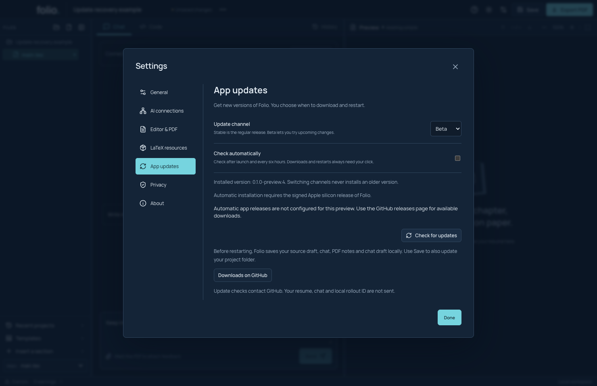
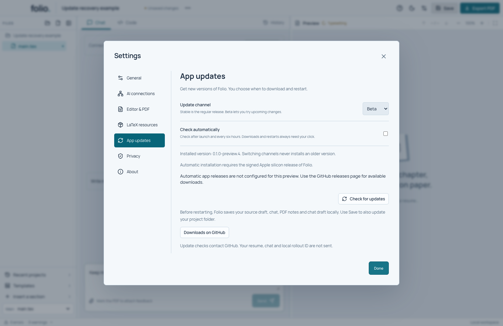
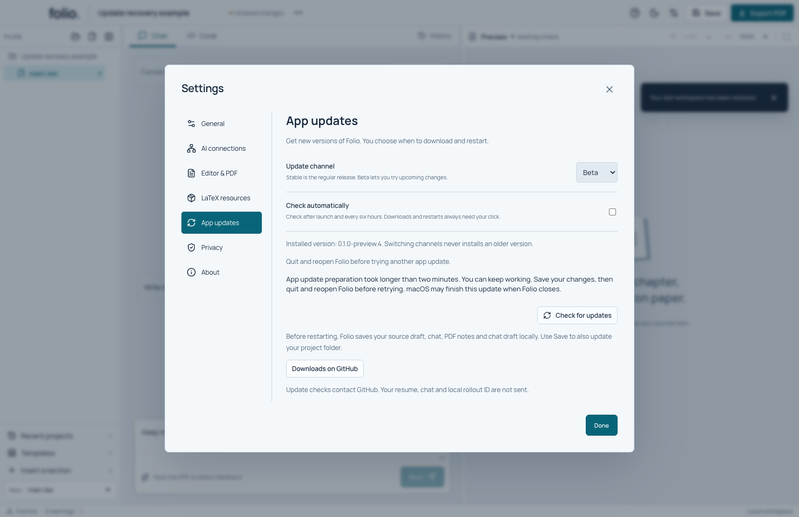
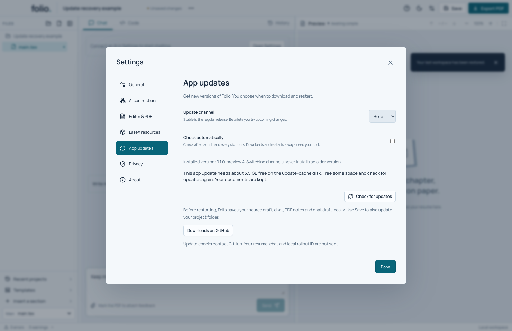

# Check for a new Folio version

These screens are in the current source build. The older public preview 4 does not have them. Automatic installation is still waiting for a signed production release and publisher setup.

1. Open **Settings → App updates**. You can also choose **Folio → Check for updates…** from the Mac menu.
2. Pick **Stable** for regular releases or **Beta** to try upcoming changes.
3. Click **Check for updates**. You can turn on **Check automatically** to check after launch and every six hours.

Checking does not download a new app or restart your work. Folio checks the publisher's signature before trusting a release. Your resume and chat are not sent with the check.

## What the preview shows

The current preview says that app releases are not configured. That is expected: it will not install an unsigned update. **Downloads on GitHub** opens the available releases so you can read their instructions. Use the exact release notes to see whether a download is signed and which features it includes.

Your Stable/Beta choice stays selected when you close and reopen Folio. Switching to Stable never installs an older app. If you already have a newer beta, you may need to wait for the next stable release.

## When signed updates become available

Folio will offer **Download update** for a newer release that supports your Mac and local data. Some releases reach a small group first. If your update is not ready yet, check again later.

After downloading, **Save recovery & restart** saves your source draft, chat, PDF notes and unfinished chat message locally before restarting. Finish any running save, build or AI request first. If saving fails, Folio stays open. Use the normal **Save** command as well when you want the project folder to contain your latest work.

The next launch will tell you whether the update finished. If it did not, your recovery copy remains available. Check again or use the GitHub download instructions. Do not delete your project or recovery folder to fix an update.

**Demo:** `npm run test:updates` checks the real preview Settings and close/reopen behavior using a made-up project and chat draft. It does not demonstrate a signed app installation. See [developer details and remaining tests](../APP_UPDATES.md).

When downloads are enabled, **Cancel download** stops the transfer and closes its temporary file. Check again to retry. A failed checksum or a download larger than its signed size is rejected; Folio does not restart from those bytes. These safeguards have automated Electron tests, while a real signed upgrade remains on the release checklist.

## If preparing an update takes too long

Folio waits up to two minutes for macOS to prepare the update. If that fails or takes longer, Settings shows a message and lets you return to your document. Your recovery copy stays saved. You can keep editing.

Save your latest changes, quit Folio and open it again before trying another update. macOS may finish the update when you close Folio. The next launch tells you whether it finished. Folio will not start a second update while an earlier one might still be preparing.

This screenshot uses the real Settings screen with a simulated failure. It demonstrates returning to work; it does not show a real signed update. The test also edits the project name and chat draft afterward, then verifies both survive closing and reopening Folio.

## If your disk needs more space

An update needs room for the downloaded file and the new app. Folio checks before downloading and again before preparing the restart. If there is not enough room, it tells you roughly how much free space it needs. Free some space, then choose **Check for updates** again. You can keep working on your resume.

This is a real Settings screen with a simulated low-disk message. The test does not fill your Mac's disk or install a new app.

Folio removes recognized old and unfinished app downloads when you try a new download. It keeps one matching download for retry. If it finds unexpected files or links in that cache, it stops and leaves them alone. Use **Downloads on GitHub** for the manual installation instructions. Do not delete your resume or recovery folder to make an update work.
