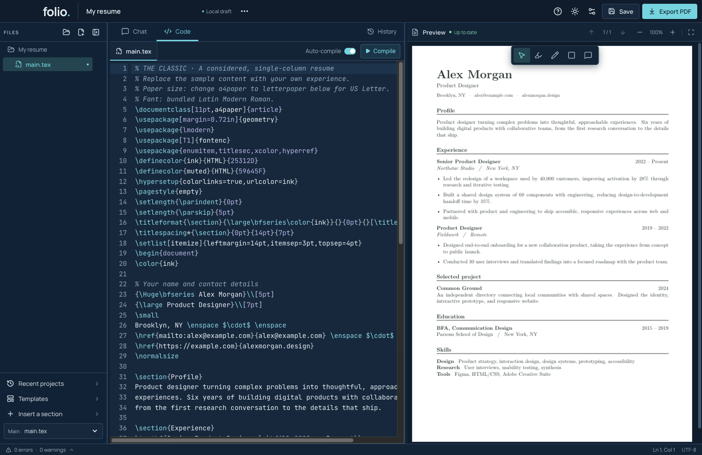
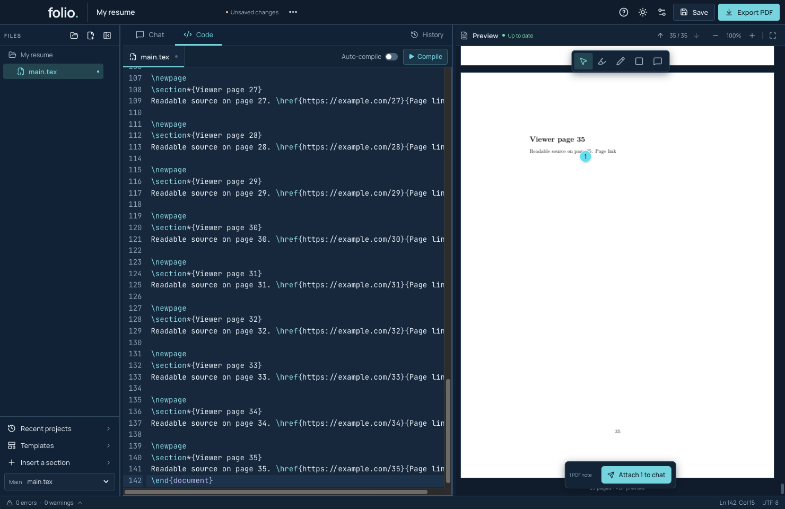

# Edit TeX and check the PDF

## Code, search and sections

1. Open **Code** and select a file in the sidebar or its tab.
2. Press Command + F to search. Use Command + Z to undo and Command + Shift + Z to redo. Each file keeps its own editing history during the session.
3. Edit plain text while keeping TeX commands and matching braces intact. Command suggestions appear as you type.
4. Use **Insert a section** for a starting block, then replace its sample content. Put content before `\end{document}`.
5. With **Auto-compile** on, pause typing to build. With it off, click **Compile** or press Command + Enter.

For a small exercise, rename `Alex Morgan` in the Classic template, build, then undo the edit and build again. Do not change a command such as `\bfseries` when you only intend to change the name.

## Find a build error

Try removing a closing brace in a disposable sample. The new build should fail and keep the last successful PDF visible. Open the error count at the bottom, select a source-linked diagnostic, and inspect the indicated line. **Raw log** gives more compiler detail. Fix the brace and build again.

The previous PDF may look fine while the current source is broken. Check **Up to date** before using it. Export recompiles changed source and waits for a current rendered preview; it does not silently export a stale success.

## Read and export the PDF

Scroll, use page arrows, or enter a page number. Use − and + to zoom and **Fit to width** to reset the view. In selection mode, text can be selected and document links can be followed. Switch to a mark tool when you want to annotate.

Choose **Export PDF**, pick a filename, and open the result to check it. Marks and notes stay out of the exported PDF. The viewer supports up to 100 pages and 25 MiB with geometry and rendering limits. AI image review has a separate 20-page limit. Simplify an oversized document; do not assume increasing zoom changes these limits.

If a replacement PDF fails to load, Folio keeps the previous view. Fix the source and rebuild before exporting. See [viewer limits](../PDF_VIEWER_LIMITS.md).

**Demos:** `npm run test:desktop`, `npm run test:compact`, and `npm run test:pdf-viewer` exercise editing, diagnostics, navigation, links, zoom and failed-preview recovery with synthetic inputs.
