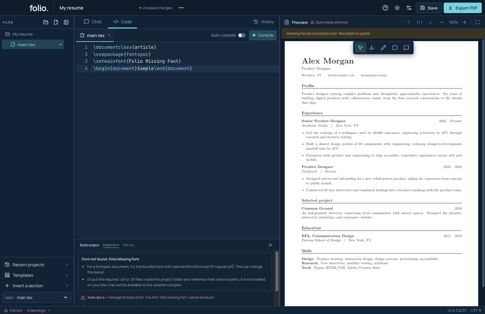
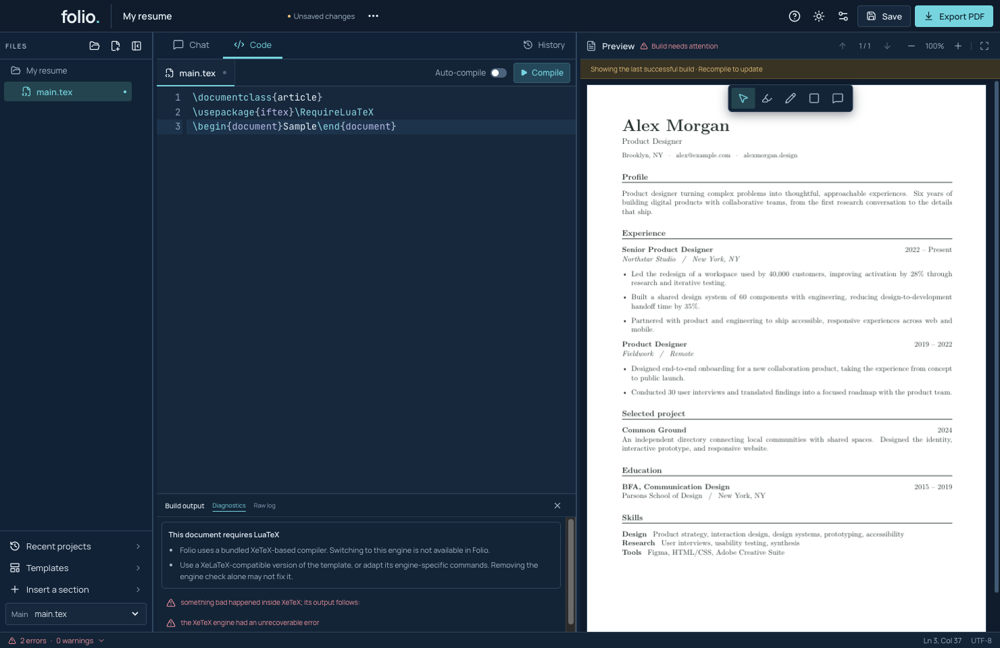
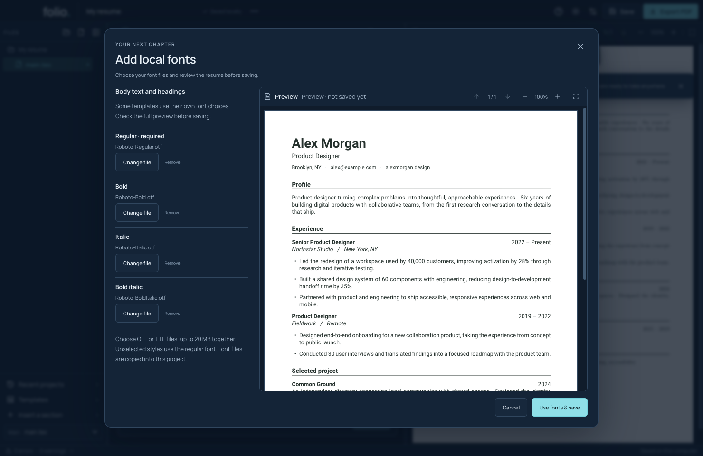
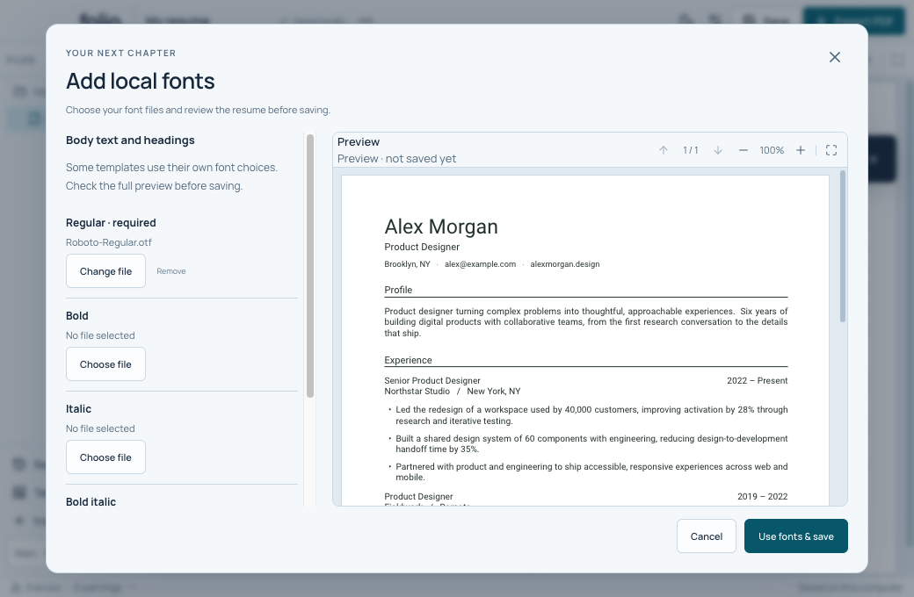

# Edit TeX and check the PDF

## Code, search and sections

1. Open **Code** and select a file in the sidebar or its tab.
2. Press Command + F to search. Use Command + Z to undo and Command + Shift + Z to redo. Each file keeps its own editing history during the session.
3. Edit plain text while keeping TeX commands and matching braces intact. Command suggestions appear as you type.
4. Use **Insert a section** for a starting block, then replace its sample content. Put content before `\end{document}`.
5. With **Auto-compile** on, pause typing to build. With it off, click **Compile** or press Command + Enter.


For a small exercise, rename `Alex Morgan` in the Classic template, build, then undo the edit and build again. Do not change a command such as `\bfseries` when you only intend to change the name.

## Find a build error

Try removing a closing brace in a disposable sample. The new build should fail and keep the last successful PDF visible. Open the error count at the bottom, select a source-linked diagnostic, and inspect the indicated line. **Raw log** gives more compiler detail. Fix the brace and build again.

The previous PDF may look fine while the current source is broken. Check **Up to date** before using it. Export recompiles changed source and waits for a current rendered preview; it does not silently export a stale success.

## Fix a missing file, font or package

When Folio recognizes the problem, **Build output → Diagnostics** shows a short explanation above the original errors. Select an error with a filename and line number to jump there. Switch to **Raw log** for the full compiler output. At a small window size, scroll inside Build output to read the rest.

| Message | What to try |
| --- | --- |
| Missing project file | Put the missing file inside your saved project folder, or fix the filename and relative path in Code. Review Folio's outside-file changes if prompted, then compile. |
| Missing LaTeX package or class | Check whether the original template came with the named `.sty` or `.cls` file. Keep it in the project folder at the path used by the source. If you do not have it, adapt the template to the bundled packages. Builds cannot download packages. |
| Font not found | For a document that already uses `fontspec`, try `\setmainfont{lmroman10-regular.otf}`. This bundled font can change the layout. You can also keep your own `.otf` or `.ttf` files in the project and refer to their relative paths. Fonts installed elsewhere on your Mac may be unavailable to the isolated compiler. |
| This document requires LuaTeX or pdfTeX | Use a XeLaTeX-compatible template, or adapt the commands that need the other engine. Folio cannot switch to LuaTeX or pdfTeX. Deleting the engine check alone may leave other incompatible commands. |



To try the font fix safely, create a disposable resume, turn **Auto-compile** off, and replace its main source with:

```tex
\documentclass{article}
\usepackage{fontspec}
\setmainfont{Folio Missing Font}
\begin{document}Sample\end{document}
```

Click **Compile**. Read the font advice, then replace `Folio Missing Font` with `lmroman10-regular.otf` and compile again. The PDF should show “Sample,” the advice should disappear, and the status should say **Up to date**.



The advice covers recognized messages, not every possible LaTeX error. An unfamiliar failure keeps its original diagnostics and raw log. Compiler-file damage has a separate Settings repair flow. A recognized font error also offers **Add local fonts…**. This opens the font picker; it does not automatically fix an earlier broken command or install packages.

## Use your own font files

1. Open **More project actions → Add local fonts…**. If asked, save your resume in a project folder first.
2. Choose an `.otf` or `.ttf` file for **Regular**.
3. Choose the matching **Bold**, **Italic** and **Bold italic** files if you have them. A style left empty uses the regular file, so bold or italic text may lose that look.
4. Click **Build font preview**. Scroll through every page. A new font can make words wider, move lines, or add a page.
5. If you like it, click **Use fonts & save**. Folio saves the font files with your resume. It does not install them for the rest of your Mac.
6. Choose **Cancel** if you want to keep the current resume. Picking files and building the preview alone do not change the saved project.



The files can total up to 20 MB, and the whole project must stay within 200 files and 25 MB. Choose regular OTF/TTF files, not a font collection or web font. **Save As** and **Export LaTeX source…** include the fonts. Check the font's sharing terms before sending that ZIP to someone else.



This changes the usual body and heading fonts. Some templates choose their own fonts in other places. If a missing-font error remains, open Code and fix or remove the earlier command that asks for that missing font. The picker adds a new setup; it does not rewrite every font command. Use **History** to restore an earlier source/PDF version, then build and save it. Folio keeps old imported font files so those versions can still use them.

If another app changes your project while you preview, Folio stops the save. Close the font screen, review the outside changes, then start a new preview. See [local font details and checks](../LOCAL_FONTS.md). `npm run test:fonts` reproduces the workflow with synthetic data and the real compiler.

## Read and export the PDF

Scroll, use page arrows, or enter a page number. Use − and + to zoom and **Fit to width** to reset the view. In selection mode, text can be selected and document links can be followed. Switch to a mark tool when you want to annotate.


Choose **Export PDF**, pick a filename, and open the result to check it. Marks and notes stay out of the exported PDF. The viewer supports up to 100 pages and 25 MiB with geometry and rendering limits. AI image review has a separate 20-page limit. Simplify an oversized document; do not assume increasing zoom changes these limits.

If a replacement PDF fails to load, Folio keeps the previous view. Fix the source and rebuild before exporting. See [viewer limits](../PDF_VIEWER_LIMITS.md).

**Demos:** `npm run test:diagnostics` exercises real missing-package, file, font and engine failures, source links, compact dark/light layouts and the bundled-font repair. `npm run test:desktop`, `npm run test:compact`, and `npm run test:pdf-viewer` cover the broader editing and PDF workflows with synthetic inputs.
