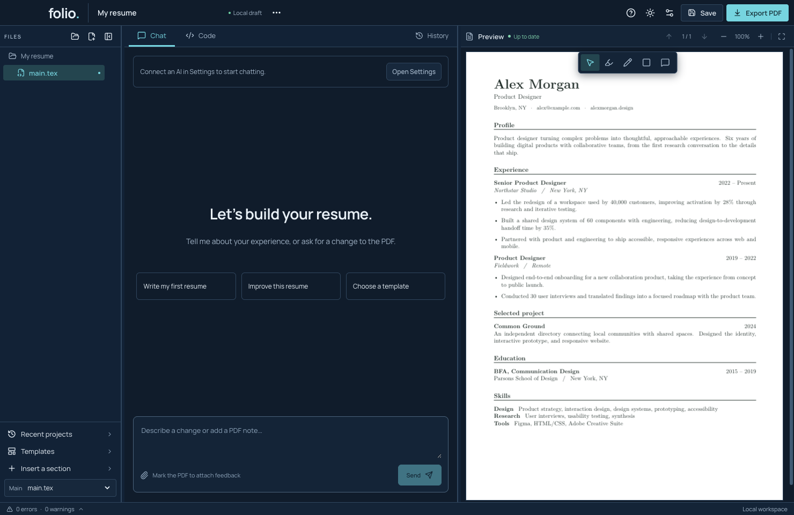
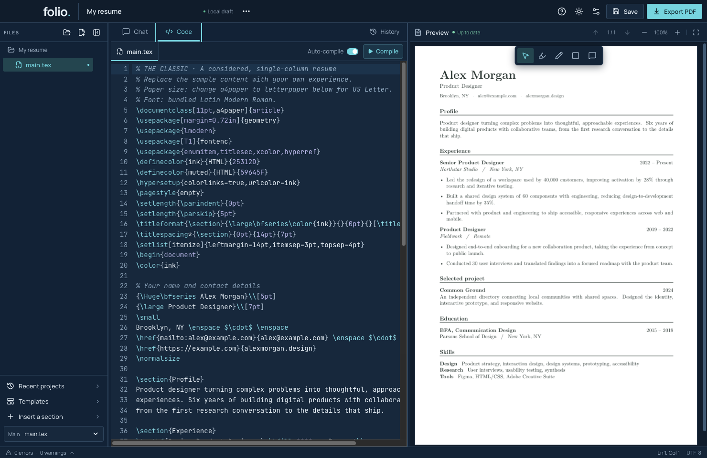
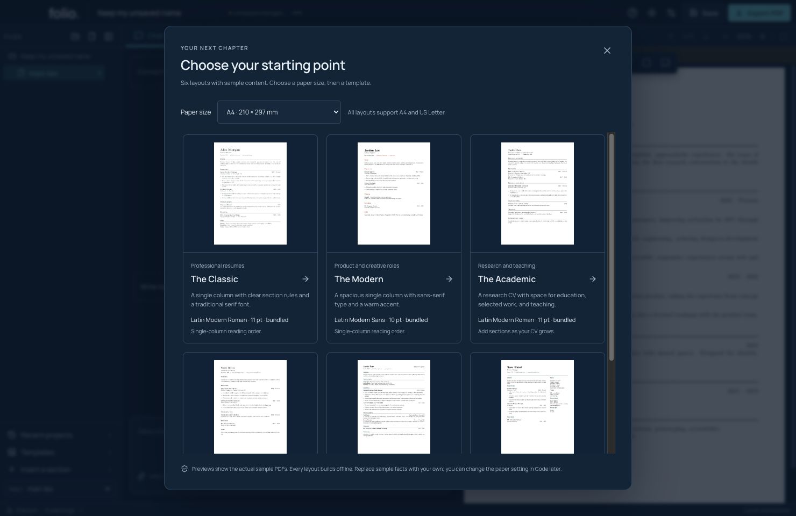
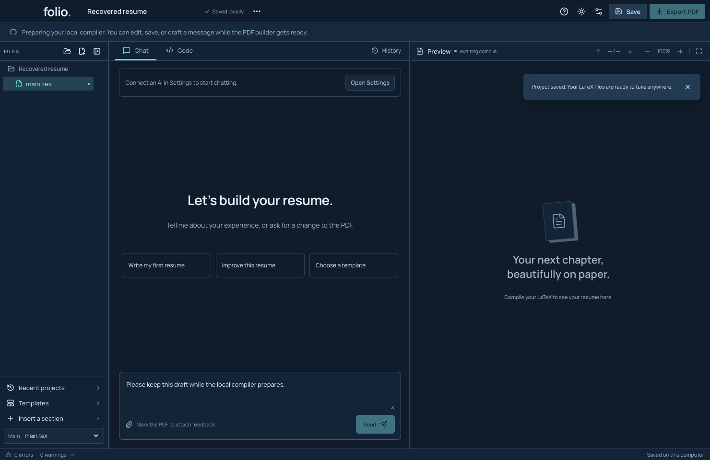

# Make and export your first resume

This walkthrough uses a built-in template and works without an AI account. Folio's main workspace is Chat; Code is available when you want to edit the document yourself.



## Move around with the keyboard

This improved keyboard flow is in the current development source; it is not in the preview-4 installer.

1. Press **Tab** to move between controls. **Shift + Tab** moves backward. A ring shows which control has focus.
2. When **Chat** or **Code** has focus, press **Left Arrow** or **Right Arrow** to switch views. Your draft stays in place. **Home** chooses Chat; **End** chooses Code.
3. Press **Tab** to leave the view tabs and move to the next control. You do not need to tab through both views.
4. Focus **Settings**, then press **Enter**. Tab to a section and press Enter to open it.
5. Press **Escape** to close Settings. Focus returns to the Settings button, so you can keep using the keyboard.



Dialogs keep keyboard focus inside while they are open. Some dialogs must finish a save or other operation before they can close. These controls have been checked in the real app with automated key presses; testing with VoiceOver and the full set of supported Macs is still needed.

## Choose a starting point

1. Open Folio. Your saved work opens first; the included PDF builder prepares in the background.
2. Click **Templates** in the left sidebar, or choose **… → Explore templates**.
3. Choose **A4** or **US Letter** in **Paper size**.
4. Choose **The Classic**. Its sample resume opens beside the Chat pane.



The sample person and achievements are examples. Replace them with your own facts before sharing your resume. The template picker also includes Minimal, Modern, Compact Technical, Academic and Two Column designs.

## Work while the PDF builder gets ready

This faster opening flow is in the current development source. The published preview-4 installer still waits for compiler preparation before opening the workspace.

1. Wait for your saved resume to appear. Folio protects it while it loads.
2. If the top bar says **Preparing your local compiler**, you can already change the source in **Code**, write a draft in **Chat**, choose a template, or **Save**.
3. **Send**, **Compile**, and **Export PDF** become available after the compiler passes its checks. You do not need to send a request again: your message stays in the box until you choose **Send**.
4. You can close Folio during preparation. Your loaded edits and message draft are recovered when you reopen it.



This is a real app capture with a made-up resume. No AI account is connected. If loading saved work fails, Folio keeps its recovery files and shows **Try again** or **Review interrupted saves**.

## Change the sample name

1. Open the **Code** tab.
2. Press **Command + F**, search for `Alex Morgan`, then close the search panel.
3. Replace the sample name in the source with your name. Keep the nearby TeX commands and braces.
4. With **Auto-compile** enabled, wait for the PDF to update. If it is disabled, click **Compile** or press **Command + Enter**.
5. Read the name in the PDF to check the result.

For example, the name line contains `\bfseries Alex Morgan`. Change the words `Alex Morgan`, not `\bfseries`. The latter tells the PDF builder to use bold text.

Repeat this for the contact details, profile and experience. Keep the original structure while learning. A percent sign in ordinary text should be written as `\%` in TeX.

## Save the project

1. Change the project name at the top if you want a more useful label.
2. Click **Save** or press **Command + S**.
3. On the first save, choose the folder for this project.
4. Wait for **Saved locally**.

Your project includes editable source files. Local recovery helps after an unexpected close, but Save is how you keep your project folder up to date.

To make an independent copy, use **… → Save project as…**. To give somebody an editable source archive, use **… → Export LaTeX source…**. The source archive includes saved conversation/history where present; it does not include AI credentials.

## Export the finished PDF

1. Read every page on the right. Use the page arrows, zoom controls or scrolling as needed.
2. Check that the preview says **Up to date**.
3. Click **Export PDF** and choose a filename.
4. Open that PDF to check the exported result.

Export requires a successful build and a current rendered preview. If you have edited the source since the last build, Folio builds it before exporting. PDF feedback marks and notes are kept out of the exported PDF.

## Reopen your work

Close Folio normally, then open it again. You can reopen a saved project with **Recent projects**, **… → Open project…**, or **… → Open project folder…**. The folder command offers a main-document choice when several TeX files are present.

## If something goes wrong

If the new source does not build, the last successful PDF stays visible. Open the error count at the bottom, choose a source-linked diagnostic, and fix the indicated line in Code. Build again and check the PDF before exporting.

If files changed in another app, review Folio's outside-file message before replacing or reloading anything. If a ZIP import was interrupted, follow [the import-recovery walkthrough](recover-an-import.md).

## Developer demonstration and verification

The native template suite exercises every layout at both paper sizes, actual compilation, PDF export and restart:

```sh
npm run test:templates
```

The packaged smoke suite proves that the standalone Mac app compiles using its included resources. See [template evidence](../TEMPLATES.md) and the current release README. The tutorial screenshots show the actual app with synthetic sample content. The [demo gallery](../demos/README.md) links reproducible walkthroughs; these are screenshot demos, not videos.
