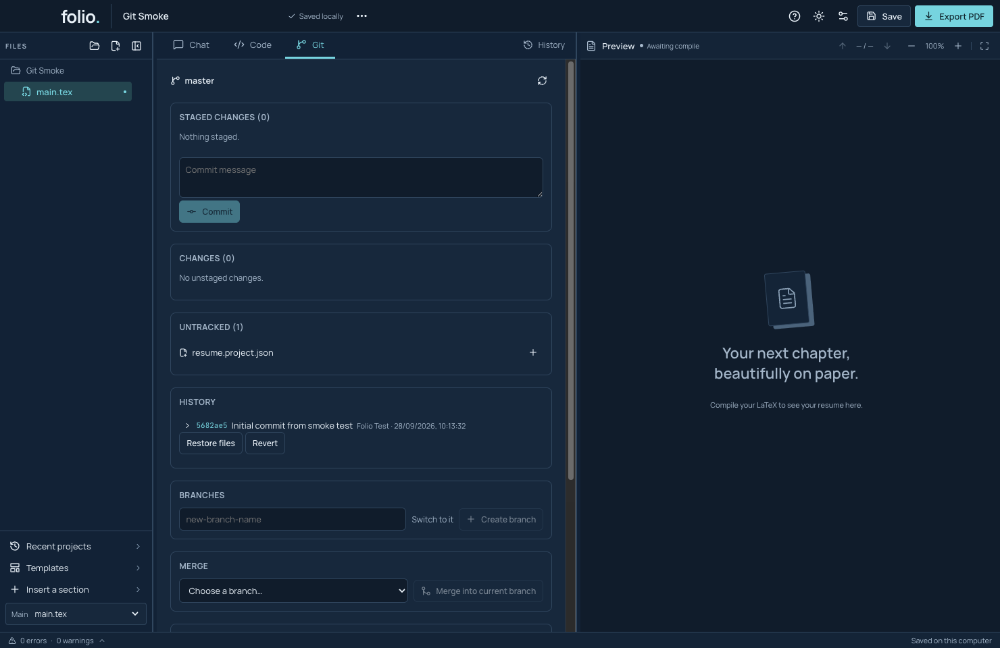

# Keep project versions with Git

Git remembers changes to files in your saved project folder. A **commit** is a named checkpoint. This feature is included from preview 5; it is not in the older preview-4 download. Folio's PDF **History** remains a separate way to compare built PDFs and restore resume versions.

## Before you start

The Git tab uses a Git installation on your Mac; this preview does not bundle Git. If it is unavailable, the panel reports **Git isn’t installed**. Git also needs a commit name and email. These are separate from your AI connection. The basic demo below uses an installed Git and a private synthetic identity; it does not prove Git setup on a clean consumer Mac.

## Make your first commit

1. Save your project to a folder. Save your latest edits before choosing files in Git: Git reads files on disk.
2. Open the **Git** tab beside Chat and Code.
3. If Folio shows **Set your Git identity**, follow its name and email instructions, then reopen the Git tab. The identity is attached to your commits; it is separate from your AI account.
4. Choose **Initialize repository** if this folder does not already use Git.
5. Find a file under **Untracked** or **Changes**. Choose its name to expand a line-by-line diff of that file's changes (binary files show a notice instead), or choose its **Stage** button. Staging chooses the saved changes for the next checkpoint.
6. Review **Staged changes**, write a short **Commit message**, and choose **Commit**.
7. Look for your message under **History**. Open a history row to inspect its file changes.

This real development-app screenshot shows a synthetic project and local test identity. The PDF has not been built in this capture; the check concerns Git. Only `main.tex` was staged, so `resume.project.json` remains untracked. Decide which project files you want to include before making your own commit.

A local commit stays on your Mac until you deliberately send it to a remote repository. Committing does not send your resume to an AI provider.

## Try another version of your resume

A **branch** lets you keep a different line of changes. Save your work and make a commit before switching branches. Under **Branches**, enter a new name, choose whether to **Switch to it**, then choose **Create branch**. Use a branch for a different job application while keeping your starting version available.

Git operations can change files outside Folio's editor. If Folio shows an outside-file review, read the differences and choose which contents to keep. Return to Code, compile, and inspect the PDF after applying those changes.

## Other controls

| Control | What it does |
| --- | --- |
| Unstage | Takes a file out of the next commit; its saved edits remain. |
| Discard changes | Replaces selected saved edits with the repository version. Read the confirmation before applying it. |
| Restore files in History | Writes files from that commit into the working folder. Review the resulting changes before saving or committing again. |
| Revert in History | Asks Git to undo the selected commit with a new commit; conflicts may need resolution. |
| Merge into current branch | Combines another branch with the current one. If conflicts appear, inspect the base, mine and theirs versions, edit the result, and continue only when the intended content is ready. |
| Stash | Stores unfinished saved changes temporarily. Review a stash before applying it or dropping it. |
| Remotes | Lists other copies of the repository. Fetch, Pull, Push and Clone contact the selected remote and use your Git credentials. |

These controls operate on the repository; PDF History, source recovery and a Git commit are different records. Check which record you are restoring. Git connection settings do not select an AI provider; that remains in Folio Settings.

## Reproduce the basic demo

Run `npm run test:git` after developer setup, or `node scripts/test-git.mjs /path/to/Folio.app/Contents/MacOS/Folio` for an existing package. The script uses an isolated app profile, a temporary repository and a private synthetic Git configuration. It checks the identity prompt, initializes and stages through the visible controls, makes a real local commit, verifies its exact source through Git, and reopens Code. It prints the evidence directory and captures `committed.png`.

The basic native workflow and backend tests do not qualify every remote credential provider, branch/conflict interaction or operating-system version. Remote operations are not exercised by this demo. See [release status](../RELEASE_GAP_AUDIT.md) for the current package gates.
