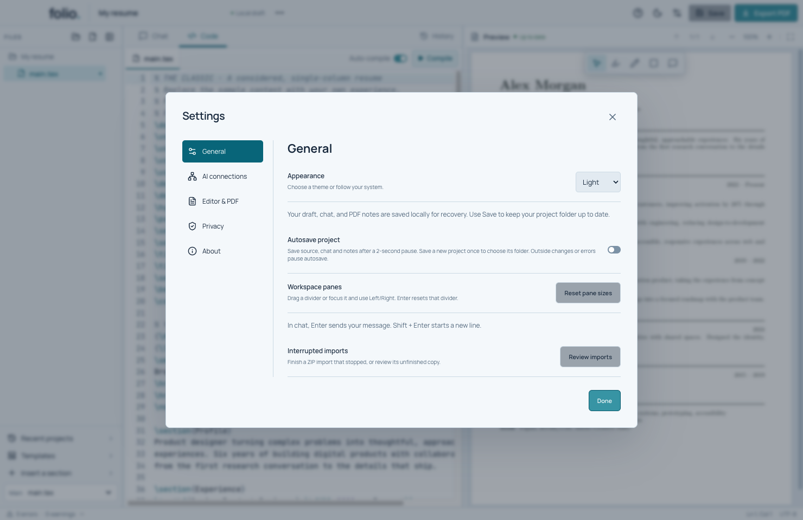
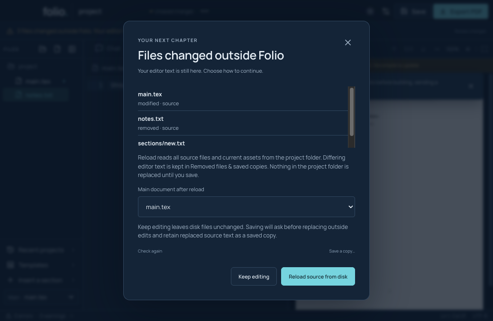

# Save your work and handle outside changes

## Save and autosave

Click **Save** or press Command + S. The first save asks for a folder. Wait for **Saved locally**. Local recovery and a saved project folder serve different purposes: recovery helps reopen your draft, while Save updates the folder you chose.

To turn on autosave, open **Settings → General → Autosave project**. Save once to choose a folder. After that, Folio saves source, chat and notes after a two-second pause. Autosave waits during AI work and other saves, and pauses for outside changes or errors.

Close Folio normally and reopen it to check recovery. If a dialog asks about unsaved changes, choose the action that fits: save, keep the current project open, or discard only when you intend to lose those changes. Do not test forced crashes with your only copy of a real resume.

## When another app edits the folder

1. Choose **Review changes** when Folio reports outside-file changes.
2. Read the list of modified, added or removed files.
3. Choose **Keep editing** to leave the disk files alone for now, **Save a copy…** to preserve your editor state elsewhere, or **Reload source from disk** to use the outside changes.
4. If reloading, confirm the main document. Differing editor text is preserved in **Removed files & saved copies**.
5. Rebuild and inspect the PDF before exporting.

Builds, exports and AI application wait while source or assets need review. Saving can ask before replacing outside edits. Read that choice carefully; don't keep retrying a save to dismiss a conflict.

## Interrupted saves and imports

Folio journals multi-file saves so it can roll back an interrupted write. If outside files changed during recovery, it preserves them rather than guessing which version you wanted. Guided resolution for every interrupted-save conflict is still in progress. Keep both copies and consult [save reliability](../SAVE_RELIABILITY.md) when a conflict cannot be resolved in the interface.

ZIP imports have their own [review and recovery tutorial](recover-an-import.md). These local crash tests do not prove power-loss or network-filesystem durability.

**Demos:** `npm run test:workspace` covers autosave, pause/retry and normal restart. `npm run test:watch` covers outside-file review and preserved copies. `npm test` includes real child-process interruption tests using disposable files.
