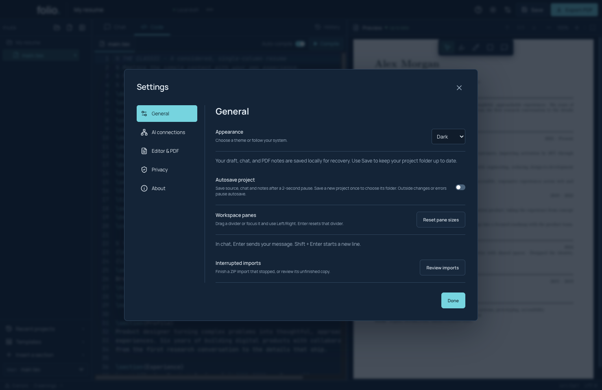
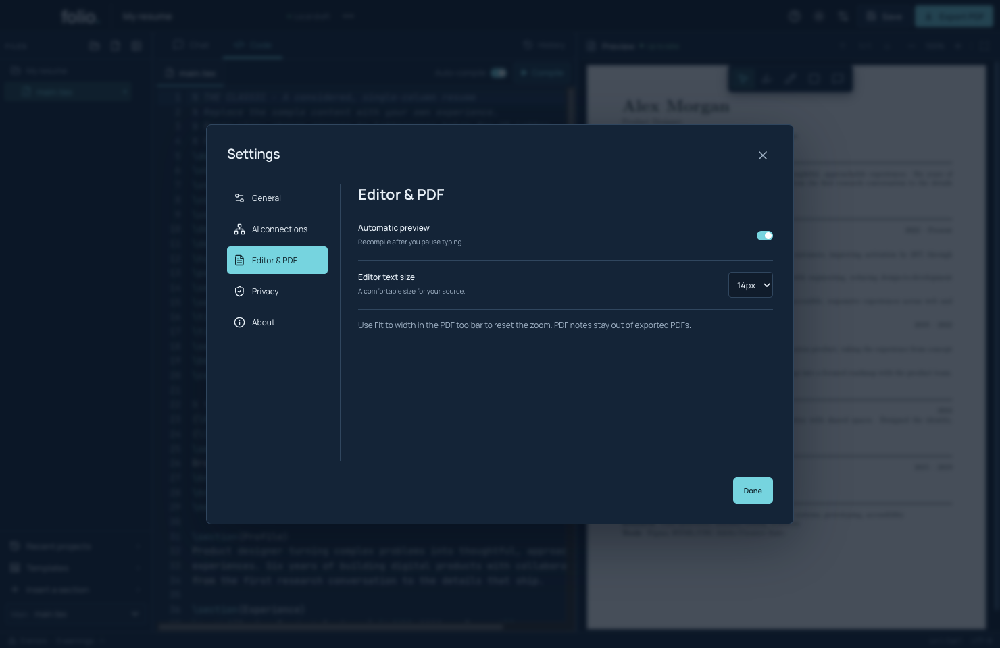
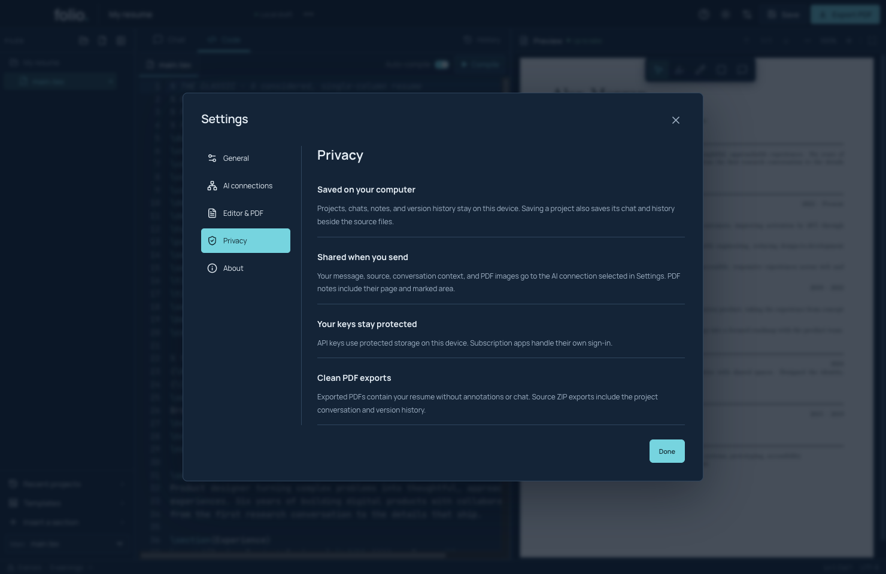
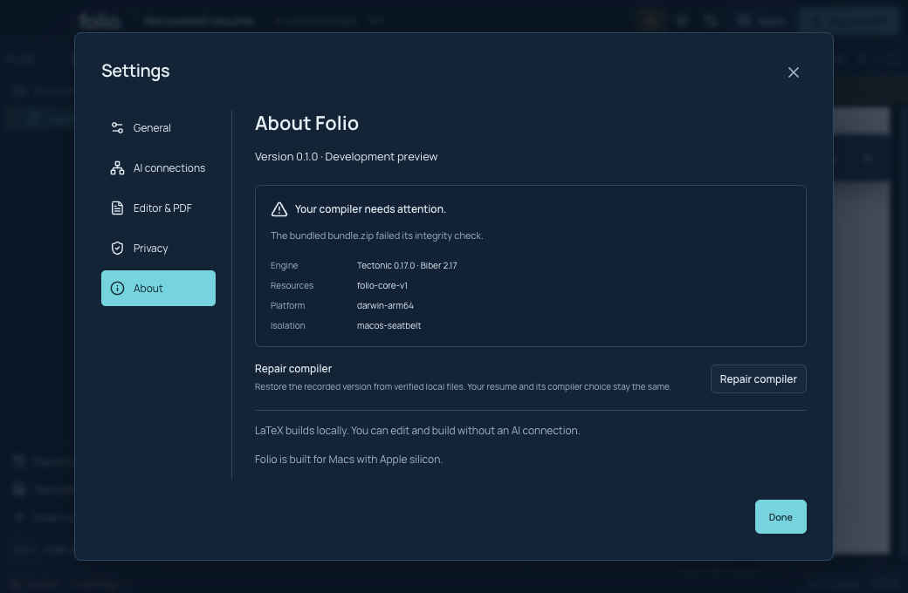
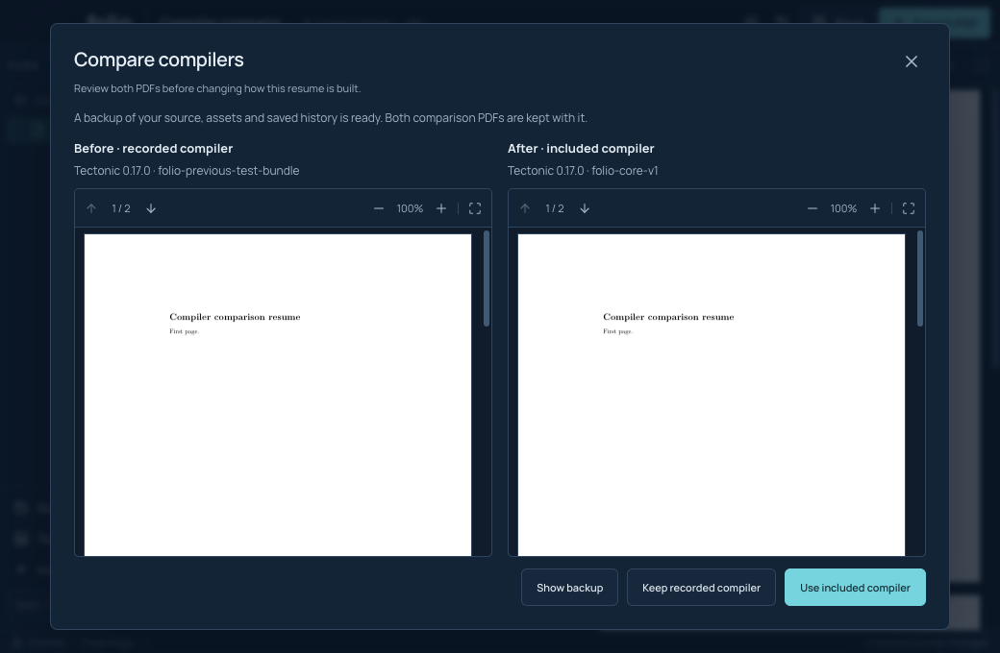

# Make the workspace comfortable and repair the compiler

## Appearance and space

Open **Settings → General** to choose Dark, Light or System appearance. The header sun/moon button switches between dark and light. The PDF keeps its paper colors.

Drag the dividers between files, writing and PDF to resize them. You can also focus a divider with Tab and press Left or Right. Enter resets that divider. **Reset pane sizes** in General resets both. The sidebar's hide/show control makes more writing room.

## Editor and PDF settings

Open **Settings → Editor & PDF**. Change **Editor text size** or **Automatic preview**. These preferences change how you work, not the typography of your exported resume; edit the TeX to change the document itself.

## Understand privacy and help

**Settings → Privacy** explains what is local and what is sent when you chat. Source ZIP exports include chat/history. PDF exports contain the resume without chat or marks. Review a source ZIP before sharing it.

The header **Help and keyboard shortcuts** button lists shortcuts. Include the version from **Settings → About** in a bug report. There is no automatic support-bundle generator yet: review logs and screenshots yourself and remove personal data.

## Repair a compiler

The compiler is the local tool that turns TeX into PDF. Projects record which compiler they use so an update does not silently change their output.

1. If Folio reports damaged compiler files, save your source.
2. Open **Settings → About** and read the compiler message.
3. Choose **Repair compiler**. Folio checks a separate replacement from matching local resources before using it.
4. Wait for the ready state, then rebuild and read the PDF.

This screenshot comes from deliberate corruption in an isolated test. Do not damage your own compiler to reproduce it. If a matching local copy is unavailable, you can still edit and save; online repair and additional managed packs are not implemented yet.

## Compare a different included compiler

If a project records a different compiler from the included one, Settings offers a comparison. Folio builds both versions and keeps a backup of the source, assets and history. Review both PDFs before choosing **Use included compiler**. **Keep recorded compiler** leaves the project's choice alone. **Show backup** opens the retained backup.

The screenshot uses a synthetic previous compiler identity to exercise the flow; it is not evidence that two real production releases produce identical output. See [compiler migration](../COMPILER_MIGRATION.md) for exact interruption and backup behavior.

**Demos:** `npm run test:workspace`, `npm run test:runtime`, and `npm run test:migration`. Runtime failure tests alter only their isolated managed copies.
