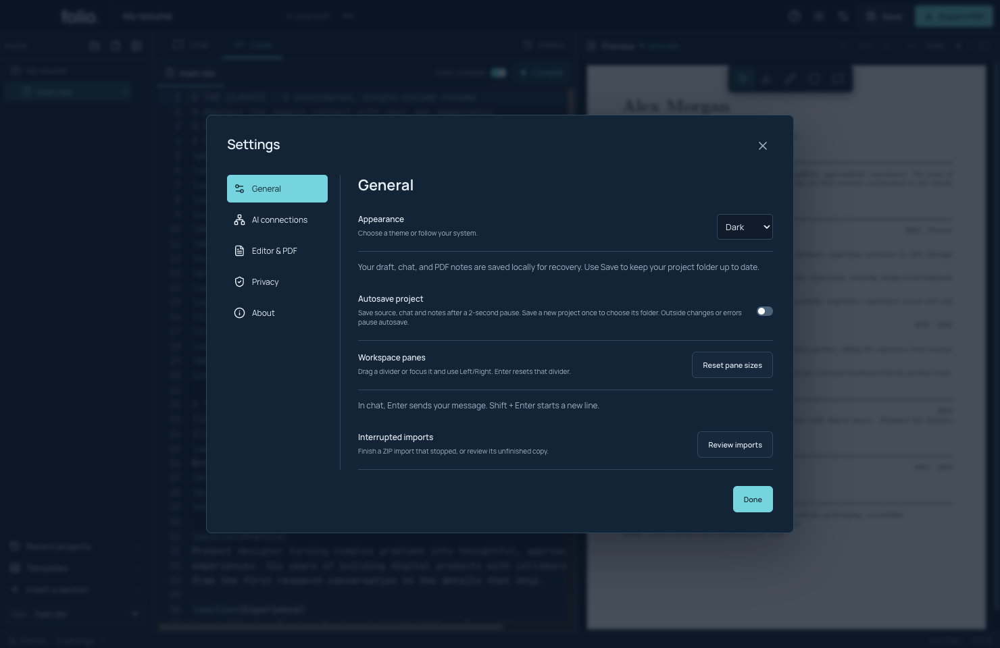
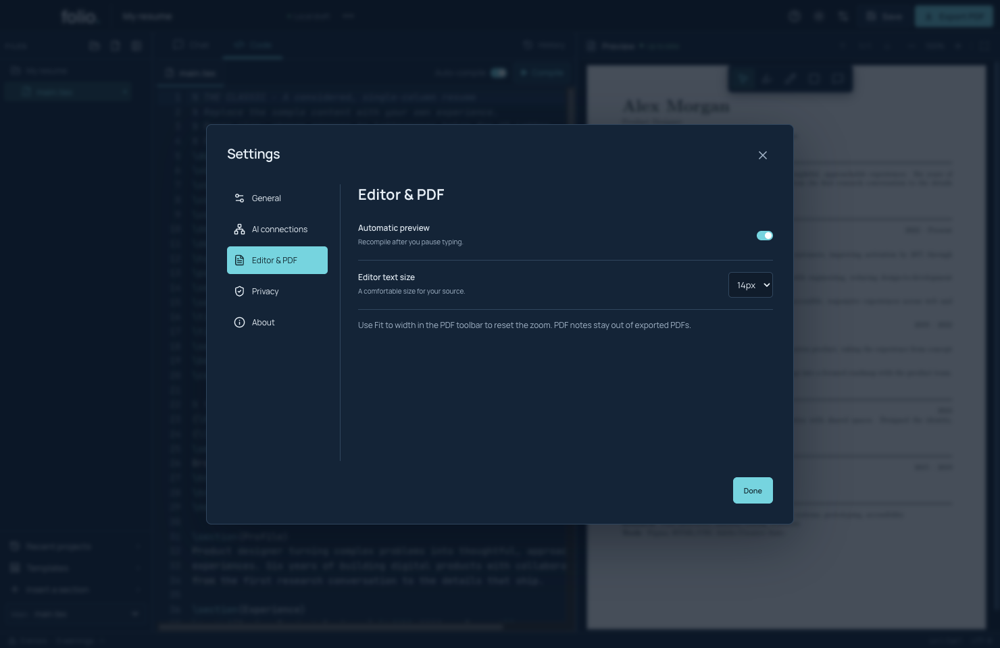
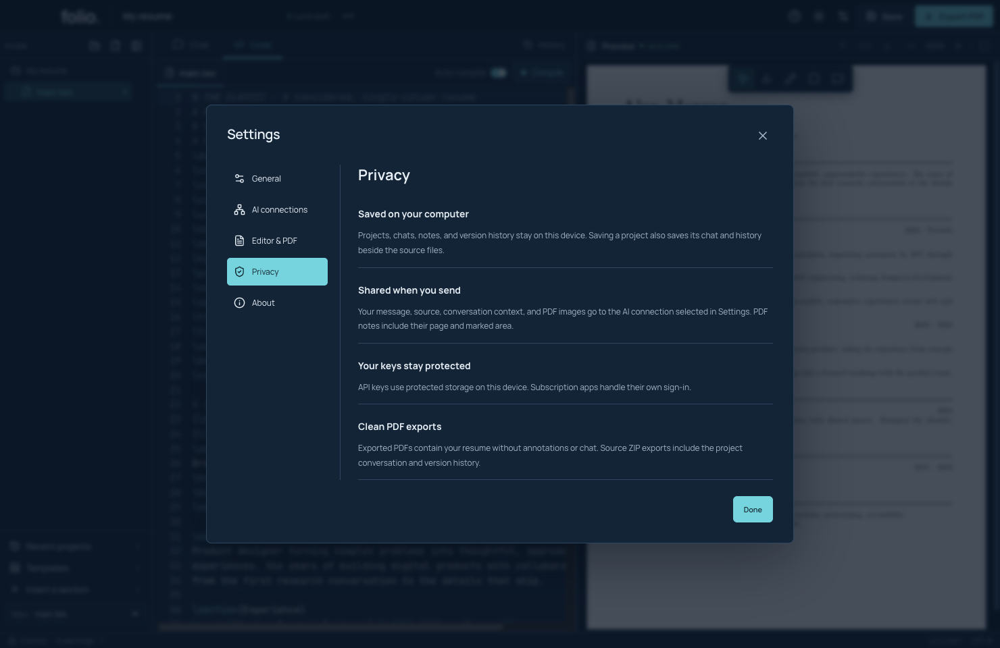
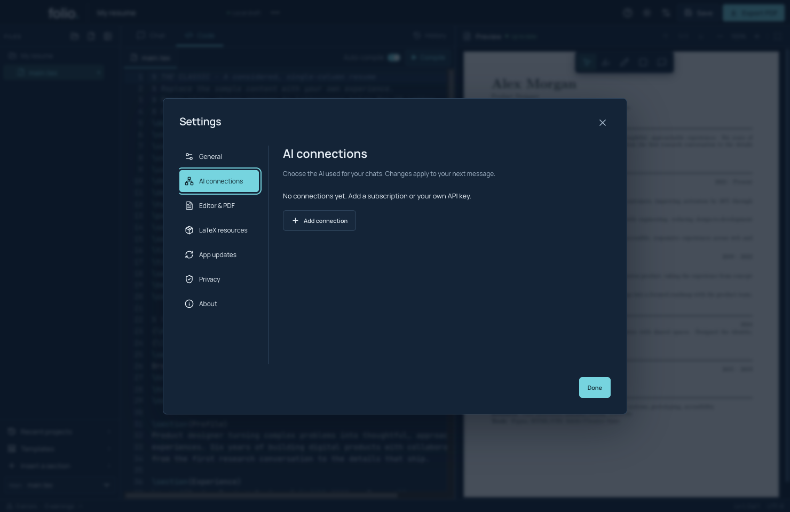
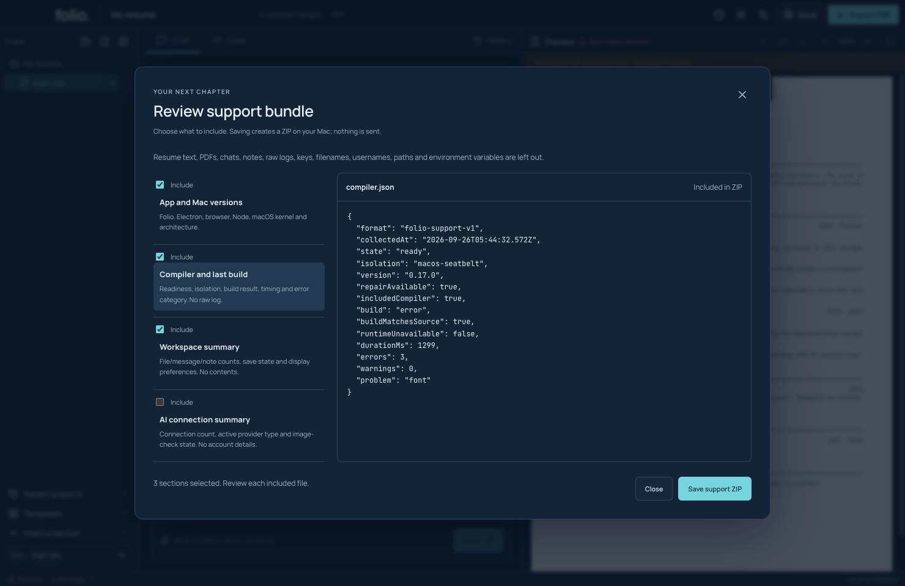
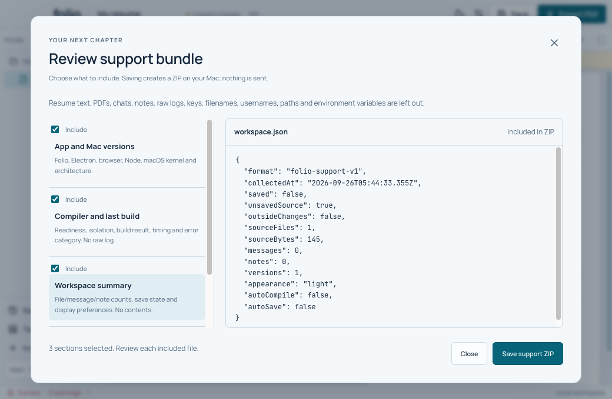
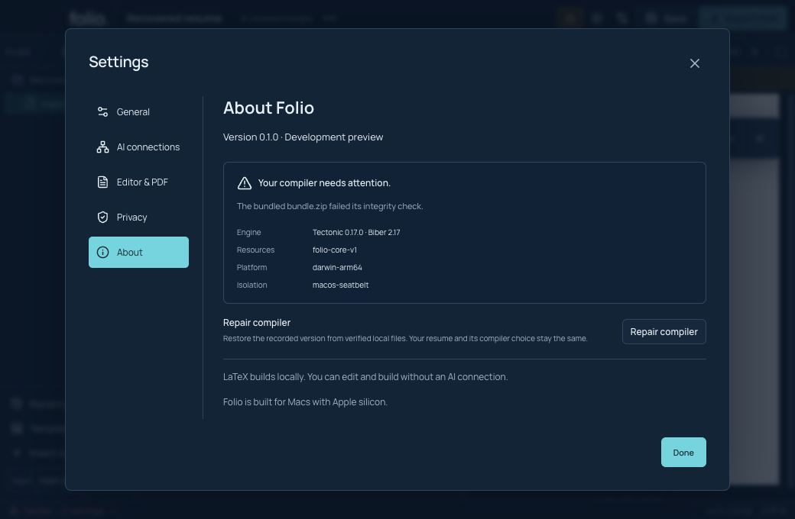
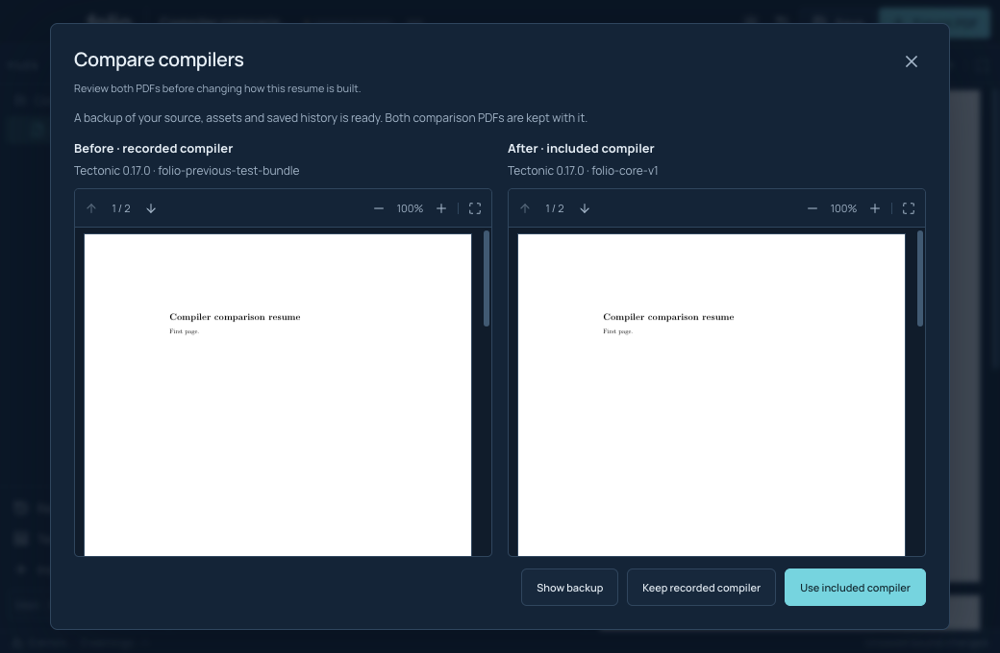
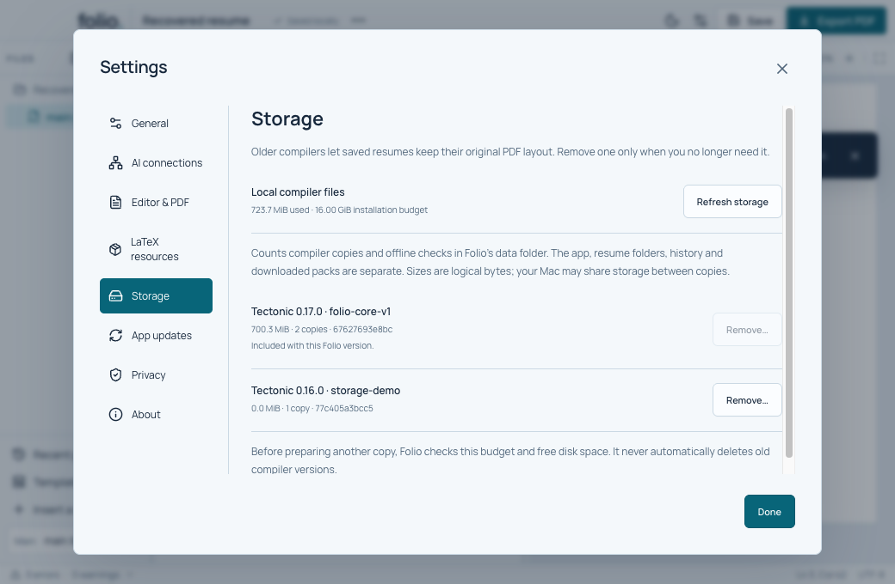

# Make the workspace comfortable and repair the compiler

## Appearance and space

Open **Settings → General** to choose Dark, Light or System appearance. The header sun/moon button switches between dark and light. The PDF keeps its paper colors.

Drag the dividers between files, writing and PDF to resize them. You can also focus a divider with Tab and press Left or Right. Enter resets that divider. **Reset pane sizes** in General resets both. The sidebar's hide/show control makes more writing room.

## Editor and PDF settings

Open **Settings → Editor & PDF**. Change **Editor text size** or **Automatic preview**. These preferences change how you work, not the typography of your exported resume; edit the TeX to change the document itself.

## Understand privacy and help

**Settings → Privacy** explains what is local and what is sent when you chat. Source ZIP exports include chat/history. PDF exports contain the resume without chat or marks. Review a source ZIP before sharing it.

Use **Tab** and **Shift + Tab** to reach a Settings section, then press **Enter** to open it. Folio exposes the current section to assistive technology. **Escape** closes Settings when no closing, restart or compiler-removal review is pending and returns focus to its opening control. See [the keyboard walkthrough](first-resume.md#move-around-with-the-keyboard).

The header **Help and keyboard shortcuts** button lists shortcuts. Include the version from **Settings → About** in a bug report.

## Make a support bundle

A support bundle is a small ZIP of facts that can help someone understand a problem. It leaves out your resume, PDF, chats, notes, keys, raw logs, usernames and file paths.

1. Open **Settings → Privacy → Review support bundle**.
2. Click each section on the left to read its file on the right.
3. Untick **Include** for any section you want to leave out. The AI connection summary starts unticked. You can include it if the provider type and image-check state would help.
4. Keep at least one section selected, then click **Save support ZIP** and choose a place on your Mac.
5. Share the ZIP yourself when you are ready. Folio does not upload or send it.

The preview is a snapshot. To collect newer information after a build or change, close this screen and open it again. If you cancel the save dialog, you can still review and save the same snapshot. If saving fails, choose another location and try again.

This ZIP contains counts and status information, not the full compiler log or the resume that failed. For a harder problem, make a small example with fake details. Do not confuse a support ZIP with **Export LaTeX source…**, which includes your source, chats and history. See [the complete file list and privacy checks](../SUPPORT_BUNDLES.md).

`npm run test:support` reproduces this workflow with synthetic private markers and a real compiler failure.

## Repair a compiler

For extra LaTeX files, see [resource packs](resource-packs.md). Their Settings workflow has a separate publisher-availability requirement; it does not use your AI subscription or API key.

The compiler is the local tool that turns TeX into PDF. Projects record which compiler they use so an update does not silently change their output.

1. If Folio reports damaged compiler files, save your source.
2. Open **Settings → About** and read the compiler message.
3. Choose **Repair compiler**. Folio checks a separate replacement from matching local resources before using it.
4. Wait for the ready state, then rebuild and read the PDF.

This screenshot comes from deliberate corruption in an isolated test. Do not damage your own compiler to reproduce it. If a matching local copy is unavailable, you can still edit and save. For additional packages, use reviewed downloads or imports in **Settings → LaTeX resources**; see [resource packs](resource-packs.md).

## Compare a different included compiler

If a project records a different compiler from the included one, Settings offers a comparison. Folio builds both versions and keeps a backup of the source, assets and history. Review both PDFs before choosing **Use included compiler**. **Keep recorded compiler** leaves the project's choice alone. **Show backup** opens the retained backup.

The screenshot uses a synthetic previous compiler identity to exercise the flow; it is not evidence that two real production releases produce identical output. See [compiler migration](../COMPILER_MIGRATION.md) for exact interruption and backup behavior.

**Demos:** `npm run test:workspace`, `npm run test:runtime`, and `npm run test:migration`. Runtime failure tests alter only their isolated managed copies.

## Make room for compiler files

This feature is in the current development source. It is not in the older preview-4 download.

Each resume remembers the compiler that built it. An old compiler may still be useful, even after Folio gets an update.

1. Finish any AI request or PDF build, then open **Settings → Storage**.
2. Read the total and the compiler list. Folio protects its included compiler, the current resume’s compiler, and a compiler that is building a PDF.
3. If you no longer need an older compiler, choose **Remove…** on its row.
4. Read the Mac confirmation carefully. **Cancel** is selected first. Choose **Remove compiler** only when you are ready.
5. Check the updated total. Your resume files and their saved compiler choices stay as they were.

**Other saved resumes can still need an old compiler.** Folio cannot know about every resume folder on your Mac or an unplugged drive. After removal, those resumes can still be edited and saved. To build their PDFs again, restore the matching Folio version and any required resource pack. Folio will not secretly choose a newer compiler for them.

If removal stops, click **Refresh storage**. An **Unfinished removal** row shows the remaining files. Review **Finish removal…** to remove them. These files are no longer offered as a usable compiler. Folio keeps unrecognized compiler files for recovery; it does not guess that they are safe to delete.

The total covers compiler copies and their offline checks in Folio’s data folder. It does not cover your installed app, resume folders, History, or separate resource-pack downloads. macOS can share space between copies, so the number may differ from Finder’s physical disk use.

Before preparing another compiler copy, Folio checks a 16 GiB installation budget and free disk space. If preparation stops for lack of room, review old compilers or free disk space, then retry **Repair compiler** or the resource-pack installation. Unrecognized or unfinished installation files are preserved; keep them for troubleshooting if the page cannot safely measure or remove them. Do not delete an unfamiliar folder to bypass the check.

**Demo:** `npm run test:runtime` uses a real current compiler and a tiny, inert old-compiler fixture in a disposable profile. It checks cancellation, changed files during confirmation, removal, unchanged source/compiler choices, and another real PDF build. Its Mac confirmation responses are controlled by the test. It does not remove any of your normal app data.

## Read the included font licenses

Current development builds include the original font licenses inside the app. This folder is not in the older preview-4 download.

1. In Finder, open **Applications**.
2. Control-click **Folio**, then choose **Show Package Contents**.
3. Open **Contents → Resources → tex-font-notices**.
4. Read **README.md** to find the notice for each font family.

The notice files keep their original wording. Folio's noncommercial license does not replace the fonts' own licenses. See [licensing](../LICENSING.md) for the complete scope and source links.

## Read the included TeX notices

Current development builds also have a **tex-resource-notices** folder beside **tex-font-notices**. The older preview-4 download does not include this new folder.

1. In Finder, right-click **Folio.app** and choose **Show Package Contents**.
2. Open **Contents → Resources → tex-resource-notices**.
3. Read **README.md** for the guide. The other notice files keep the authors' original wording.
4. **SOURCES.json** lists source links and file checksums for people who want to check the included TeX files.

These are the terms for the tools and resources that help make PDFs. Folio's own noncommercial license does not replace them. The [licensing guide](../LICENSING.md#collect-and-bundle-tex-resource-notices) explains which parts of the release review are still unfinished.

Developers can also check how the three generated TeX setup files were made. The [source replay guide](../LICENSING.md#reproduce-generated-tex-resources) explains the command and its limits. It checks original source files and leaves your app and resume unchanged.
